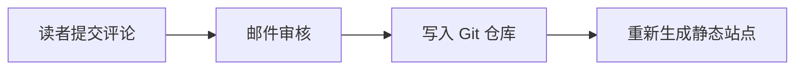

# 🍧Shiue - Xeu's mini world

基于 Hugo 和独立 **Xeu** 主题的个人博客，支持 Vercel、Netlify 和 Cloudflare Workers / Pages 的静态站点与 Serverless Functions 部署，配置见[多平台部署](docs/serverless.md)。

## 新建文章

在仓库根目录执行交互式脚本（只需 Node.js 22 或更新版本，无需先安装依赖或 Hugo）：

```bash
npm run post:new
```

依次填写标题、网址名（slug）、摘要、分类、标签、封面和草稿状态。标题必填；其他项可按回车使用默认值或留空。分类与标签填写英文标识（例如 `tech`、`essays`、`blog`），支持中文、英文逗号分隔。网址名用于文章目录及 `/p/<slug>/` 地址，默认从标题中的英文和数字生成，纯中文标题回退为带时间戳的名称，也可自行填写，例如 `my-new-post`。已有目录会提示重新输入。

脚本生成 `content/post/<slug>/index.md`，自动填入当前日期，默认 `draft: true`。封面可留空，或填写 `cover.jpg` 这样的文件名、`/images/example.jpg` 这样的静态资源路径或图片网址；本地封面需自行放到对应目录。正文图片也可直接放在文章目录中，通过 `` 引用。

也可提前传入标题：`npm run post:new -- "我的新文章"`。按 `Ctrl+C` 取消，查看帮助：`npm run post:new -- --help`。

编辑生成的 Markdown 后，运行 `npm run dev -- --buildDrafts` 预览草稿（环境准备见下文「本地构建」）；准备发布时将 `draft` 改为 `false`，再提交文章与图片。

## Mermaid 图表

正文使用标记为 `mermaid` 的围栏代码块即可绘制图表，无需短代码或额外的文章配置：

````markdown

````

主题通过 [Hugo 代码块渲染钩子](https://gohugo.io/render-hooks/code-blocks/) 接入 [Mermaid](https://mermaid.js.org/config/usage)。Mermaid 固定版本随 npm 依赖安装，由 Hugo 打包成带内容指纹的本地脚本，阅读时无需访问第三方 CDN。只有含图表的页面加载初始化脚本，图表接近视口时才下载一次渲染引擎；支持同页多图，颜色和字体沿用主题令牌，随浅色、深色及系统外观变化重新绘制。图中显式指定的节点样式仍由作者控制。

图表初始适应窗口，工具栏可放大、缩小、恢复原始大小或重新适应窗口。按住鼠标或单指拖拽可移动图表，双指捏合缩放；Ctrl/⌘ + 滚轮围绕指针缩放，双击放大，Shift + 双击缩小，普通滚轮仍滚动文章。聚焦图框后可用 `+` / `-` 缩放、方向键平移、`0` 或 Home 适应窗口、`1` 恢复原始大小。最大可放大至 400%，最小可缩至 10% 或完整显示图表所需的更小比例。每张图独立保存查看状态，明暗主题重绘时保留缩放和位置；窗口尺寸变化时，适应模式重新适应，手动查看模式保留中心位置。触屏手势只接管图框内部，图框外仍可正常滑动文章。

渲染成功后收起「图表源码」，展开后仍可复制；关闭 JavaScript、加载失败或语法错误时保留源码并隐藏交互控件，RSS 同样保留源码。使用 Mermaid 的严格安全模式，Markdown 的 `unsafe = false` 无需调整，普通代码块的高亮和复制不受影响。

`node scripts/check-build.mjs` 包含源码转义、资源路径、按页加载及 RSS 回归；在预览服务启动后，可运行 `PLAYWRIGHT_MODULE=/path/to/playwright/index.mjs SHIUE_TEST_URL=http://127.0.0.1:1313/ node scripts/check-mermaid.mjs`，验证实际渲染、多图、主题切换、手机布局、源码复制及失败回退。`node scripts/check-mermaid-viewport.mjs` 使用同一组环境变量验证缩放锚点、拖拽、真实触屏捏合、键盘、缩放边界、状态保留与多图隔离。可用 `PLAYWRIGHT_CHROMIUM_EXECUTABLE` 指定 Chromium 路径。

## X 帖子嵌入

文章中使用 `x` 短代码接入 [X 官方嵌入组件](https://help.x.com/en/using-x/how-to-embed-a-post)，支持 `x.com` 和 `twitter.com` 的 HTTPS 帖子链接：

```markdown

> 帖子的文字引用，供加载失败和 RSS 阅读时显示。

```

不需要文字引用时可写成 ``。短代码校验帖子地址，使用 X 官方 `widgets.js` 生成 iframe；接近视口时才加载脚本，同页共用一次加载，并随博客外观切换浅色或深色。原帖链接始终保留；关闭 JavaScript、网络失败或帖子不可用时显示文字引用。构建不请求 X，RSS 保留静态引用，Markdown 的 `unsafe = false` 保持开启。无需在正文粘贴 `<script>` 或原始 iframe。

嵌入区域沿用正文间距和字体，最大宽度为 550px，小屏幕随正文收缩。浏览器回归可运行 `PLAYWRIGHT_MODULE=/path/to/playwright/index.mjs SHIUE_TEST_URL=http://127.0.0.1:1313/ node scripts/check-x-embeds.mjs`。

## 主题

首页、标签及分类列表、搜索结果共用卡片样式。文章页包含目录、代码高亮与复制、图片放大和邮件审批后的静态评论；归档、友链、关于及 404 页面使用同一套样式。文章使用 `/p/:slug/`，所有页面、分类、标签、分页和别名均禁止中文路径，旧中文地址不生成页面或跳转。分类与标签在文章中填写英文标识；中文显示名称在 `content/categories/<标识>/_index.md` 或 `content/tags/<标识>/_index.md` 的 `title` 中设置。构建时校验页面及别名路径，发现中文会报错。关闭 JavaScript 后，文章、评论、导航及分页仍可阅读，列表回退为普通网格。

页面支持渐进增强的跨文档 View Transition，卡片进入视口时错峰淡入，重排采用 FLIP 位移动画。图片预览以正文图片的位置为起点展开，先显示已加载的缩略图，原图解码后淡入；关闭时缩回原位并恢复焦点。动效集中在 `assets/js/motion.js`、`image-preview.js` 和 `assets/css/motion.css`，遵循系统“减少动态效果”设置，缺少动画 API 时直接展示内容。

动画主要使用 `transform` 和 `opacity`，仅在运行期间提示图层提升。瀑布流缓存卡片尺寸，只在容器宽度或卡片实际尺寸变化时重排；滚动只在越过页头阈值时更新样式。BlurHash 仅在接近视口时分帧解码，并复用有限缓存；图片解码完成后释放占位画布，搜索更新时释放旧图片观察器。页头和预览遮罩不使用持续的背景模糊滤镜。

样式令牌集中在 `themes/xeu/assets/css/tokens.css`，布局和文章排版分别在 `layout.css`、`content.css`；交互位于 `assets/js/`。主题使用 Hugo 模板、原生 CSS 与 JavaScript；Node.js 用于构建时的图片处理和友链维护，部署产物仍是静态文件。Cantarell 字体随主题本地提供，许可见 `static/fonts/OFL.txt`。头像与 favicon 使用每次部署在线获取的 GitHub 头像，不保存到 Git 仓库。

主题默认使用纯白背景与黑灰文字，控件主色为 `#222`，按钮悬停、键盘焦点和按压逐级加深至 `#111`、`#000`。粉色仅用于普通链接、选中的目录项和 CC 许可链接；卡片、标签、代码高亮、焦点框及文本选区使用中性色或对应的语义色。页面共用间距、圆角和宽度令牌，正文最大宽度为 760px。卡片摘要最多两行，外观切换器直接位于 footer 内，选中样式与顶部导航一致；可选择浅色、深色或跟随系统并记住偏好。搜索仅在提交或输入后显示状态，移动端目录保留按需展开。评论直接展示，点击标题栏「评论」或留言行「回复」后在按钮旁展开编辑器，按文章和回复对象在浏览器本地保存草稿。评论时间使用浏览器时区，三天内可点击切换相对与绝对时间。提交表单沿用同一套字体、颜色和焦点样式。

## 评论

留言邮箱可选填，用于接收审核通过和直接回复通知。审批 Serverless Function 成功发起 GitHub Action 后发送通知，邮件失败可单独重试；通知时发布任务尚未完成。邮箱加密保存在对应文章的留言文件中。留言与友链只需生成一个 `COMMENTS_SECRET`：运行一次 `openssl rand -hex 32`，将同一值填入 函数平台和 GitHub，程序自动派生各用途密钥；已有的分用途密钥继续兼容。

读者提交 → 浏览器完成 Turnstile 验证 → Serverless Function 调用 Resend 发审核邮件 → 博主打开链接并确认 → GitHub Action 添加 `content/post/<文章目录>/comments/<UUID>.json` 并提交推送 → 托管平台的 Git 集成自动构建部署。支持多层嵌套回复，留言按文章存储并生成静态 HTML。评论 CI 不安装依赖、不构建、不调用 Deploy Hook，GitHub 只需配置同一个 `COMMENTS_SECRET`。无数据库，待审内容不进入公开仓库，读取评论不依赖 API。含绑定评论及回复对象的单次 Turnstile 验证、签名审批、7 天有效期、邮件幂等、同源校验和并发安全 Git 推送。需要配置 Turnstile、Resend、函数平台和上述 GitHub Secret 后才能启用真实收发；无需配置限流规则，当前 Turnstile 不提供请求总量或费用上限，详见 [评论系统配置](docs/comments.md)。已从旧站 Rin 公开接口恢复 105 条历史评论，去重与过滤记录见 [旧站评论恢复](docs/legacy-comments-migration.md)；更早的 Twikoo 数据不在本次迁移范围内。

卡片使用 22px 圆角、内嵌封面和轻柔阴影；图片、提示块与目录使用 16px 圆角，导航、标签及按钮采用胶囊形状。鼠标悬停时卡片轻微上浮，按钮按压时回弹，折叠内容短暂淡入；独立的 `translate` 属性避免干扰瀑布流重排，系统开启“减少动态效果”时取消这些位移动画。

文章卡片与正文使用[原生跨文档 View Transition](https://developer.chrome.com/docs/web-platform/view-transitions/cross-document) 连接标题和内容区域；正文包含与卡片相同的封面时，封面一同展开。脚本在 `pageswap` / `pagereveal` 时临时分配快照名称，结束或取消后清理，支持返回与前进。保留正常链接、新标签页和静态页面导航；关闭 JavaScript、浏览器不支持该接口或用户选择减少动态效果时正常打开文章。

## 图片加载

构建时用 Sharp 自动处理 `static/` 和 `content/` 的本地位图（也识别无扩展名图片），生成 320、480、640、768、960、1440px WebP 和 4×3 BlurHash；小图不会放大，GIF/WebP 动图保留动画。WebP 质量维持 78，使用 effort 6 提高压缩效率；产物按图片内容及处理配置哈希缓存，替换原图或调整尺寸、压缩配置时自动生成新地址。

列表最多提供 960px 缩略图，正文最多 1440px，通过 `srcset`、`sizes` 按显示尺寸和像素密度选择；首页、分页和分类/标签列表首张卡片的封面立即加载并设置高优先级，其余图片默认懒加载。立即加载的封面使用响应式 `sizes`，懒加载图片使用 `auto` 加响应式回退。图片加载前由浏览器本地解码 BlurHash 占位，失败时保留占位。点击正文图片才加载原图。首页、分类、标签和搜索使用同一套图片数据。外部图片和 SVG 保留原地址；需要缩略图时可将外部图片保存为本地资源。

`data/xeu/images.json` 与 `static/xeu-images/` 是自动生成并被 Git 忽略的文件。更新图片后执行 `npm run images`；预览时可另开终端运行 `npm run images:watch` 自动更新。BlurHash 解码器采用 MIT 许可，见 `themes/xeu/static/licenses/blurhash.txt`。

缩略图和 BlurHash 清单同时保存到 `node_modules/.cache/xeu-images/`，随 Vercel 构建缓存恢复。Vercel 安装入口会在执行 `npm ci` 前暂存、结束后放回这份缓存；未变化的图片直接恢复产物，新增或变更图片才重新处理。日志显示缓存复用、恢复及新生成数量；首次构建或平台未提供缓存时正常全量生成。详见 [图片构建缓存](docs/deployment.md#图片构建缓存)。

## 站点头像与图标

站点自身的图标来自 `https://avatars.githubusercontent.com/u/36541432`，每次部署重新下载并生成 favicon 16/32/48px、Apple 180px、Android 192px、分享图 512px，以及 48–512px 的响应式 WebP 头像。关于页显示 80px，并为高倍屏选择对应尺寸；页头仍为纯文本。生成文件与清单被 Git 忽略，内容指纹地址避免浏览器显示旧头像；`/favicon.ico` 和 `/avatar.jpg` 保留为构建时生成的兼容地址。可单独执行 `npm run identity` 刷新。详情见 [站点图标](docs/deployment.md#github-头像与站点图标)。这与下述友链图标在添加时下载并提交的规则不同。

## 友情链接

友链页支持直接发送申请，沿用留言的Turnstile 验证、邮件预览和手动审批机制。批准后自动导入站点信息与本地图标，经 Git 推送和部署显示；失败保留表单内容，重复批准不会重复添加网址。共用现有留言服务配置，详见[友链申请配置](docs/friend-applications.md)。

友链数据统一保存在 `data/friends.json`，图标保存在 `static/friends/`，两者均提交到 Git。友链页不再依赖外站图标或远程 API，地址为 `/links/`。

已于 2026-09-17 从 [xeu.life 的公开友链接口](https://xeu.life/api/friend) 迁移全部 12 条已通过的友链，保留名称、简介、网址、原图标及排列顺序，并保留本项目原有的 YiNN，共 13 条。每次部署检测站点状态，异常站点单独显示在「暂时离开」中，卡片直接显示检测状态。结果写入被 Git 忽略的 `data/xeu/friend-health.json`，覆盖初始 `health`，不改写友链名单；站点恢复后自动移回正常分组。没有检测快照时使用名单中的初始状态。`iconSource` 仅记录图标来源，不会在页面加载或构建时请求。

安装依赖后，一条命令添加友链：

```bash
npm run friend:add -- https://example.com
```

脚本自动读取站点名称（优先 `og:site_name`，其次页面标题）与简介，识别 favicon / Apple Touch Icon，支持重定向、HTML 实体与相对路径；候选图标失败时继续尝试，最后回退到站点根目录的 `/favicon.ico`。不会执行对方网页的 JavaScript。

可覆盖自动信息，或为无法访问的站点指定已知图标：

```bash
npm run friend:add -- https://example.com \
  --title "朋友的博客" \
  --description "记录生活与技术" \
  --icon https://example.com/avatar.png
```

`--icon` 也支持 `/favicon.png` 这样的站内相对路径；传入 `--description ""` 可留空简介。同时指定三个选项时不请求站点首页，只下载图标。普通位图与 SVG 转换为最大 128×128、不放大小图的 WebP；ICO 经过结构检查后保留原格式。下载有超时、文件大小与解码像素限制，图标失效时不会添加不完整的条目。页面固定图标显示尺寸，异步解码、懒加载本地小图。

重复网址会报错而不会覆盖已有条目。修改名称、简介、排序或暂离状态可直接编辑 JSON；删除友链时也应删除不再被其他条目引用的本地图标。脚本添加后，将 `data/friends.json` 和新增的 `static/friends/` 文件一起提交即可。查看帮助：`npm run friend:add -- --help`；离线回归测试：`npm run check:friends`。

## 本地构建

安装 Node.js 22 或更新版本，以及 [.hugo-version](.hugo-version) 指定版本的 [Hugo Extended](https://gohugo.io/installation/)，在仓库根目录执行：

```bash
npm ci
npm run build
```

`npm run build` 与 `npm run deploy` 是同一个入口：环境检查 → Hugo 准备 → 在线获取站点图标 → 友链检测 → 图片预处理 → 静态构建 → 产物检查。每步显示进度、日志与耗时，结束后汇总，结构化报告写入 `.cache/deploy/report.json`。产物位于 `public/`，脚本不会自行上传或触发线上发布。

离线构建使用 `npm run build -- --offline`，需要已有 Hugo 和站点图标产物，不请求外网。本地预览使用 `npm run dev`，下载头像、准备图片并启动开发服务器，不检测友链；也可先执行 `npm run identity` 和 `npm run images`，再直接运行 `hugo --minify` 或 `hugo server`。正常部署若无法获取最新头像会失败，不会自动退回旧头像。主题已在配置中启用，无需额外指定 `--theme`。架构、扩展步骤、错误策略和每日刷新配置见 [部署流程](docs/deployment.md)。

Linux x86_64 也可执行 `bash scripts/hugo.sh --minify`，会进入同一部署流程；自动下载指定版本的官方 Extended 发行包并校验 SHA-256，二进制缓存在 `.cache/deploy/hugo/`。已安装相同版本时直接复用。

## 构建验证

安装 Node.js 24，执行：

```bash
npm ci
npm run check
```

可通过 `HUGO_BIN` 指定 Hugo 可执行文件。验证覆盖部署流程的计时、失败、取消和日志，友链检测与每日空提交工作流（本地模拟服务和临时 Git 仓库，验证并发推送重试，不触发真实部署），友链添加脚本、本地图标、图片生成与缓存、BlurHash 有效性、缩略图尺寸、首页、分页、归档、标签、友链、搜索索引、RSS、纯文本页头、代码块，以及所有页面的本地链接、脚本、字体和图片。测试构建产物写入系统临时目录，图片缓存写入上述 Git 忽略目录。设置 `SHIUE_TEST_BASE_URL=https://example.org/blog/` 可验证子目录部署。友链检测暂不接入 CI。

[GitHub Actions](.github/workflows/build.yml) 在推送和拉取请求时使用最新稳定版 Hugo Extended 验证。Linux x86_64 可用同一入口检查新版本：

```bash
SHIUE_HUGO_VERSION=latest HUGO_BIN=./scripts/hugo.sh node scripts/check-build.mjs
```

浏览器回归检查使用 Playwright。先在另一个终端运行 `npm run dev -- --disableLiveReload`，在已安装 Playwright 与 Chromium 的环境中执行 `node scripts/check-theme.mjs`。可用 `PLAYWRIGHT_MODULE` 指向现有 Playwright 的 `index.mjs`，用 `SHIUE_TEST_URL` 指定预览地址。检查覆盖十二档屏宽下的四列上限、卡片重叠与溢出、BlurHash 慢速加载占位、缩略图网络请求、原图按需加载、搜索和失败重试、分页、默认纯白主题、footer 内的主题切换器、代码复制、目录背景、相邻文章对齐及无 JavaScript 回退；截图写入系统临时目录。

`node scripts/check-image-delivery.mjs` 使用相同环境变量，在独立浏览器上下文中检查桌面/手机宽度与 1×/2× 像素密度下的实际图片档位、首图网络优先级、重复下载、其余封面懒加载及无 JavaScript 回退，并保存资源体积测量与截图。

`node scripts/check-motion.mjs` 使用相同环境变量，检查图片 Hero 动画、慢速或失败原图、快速开关、键盘焦点、滚动锁定、手机尺寸、动态修改减少动效偏好、动画 API 降级和返回导航，并记录一次开合过程的帧间隔采样。帧间隔受设备与浏览器运行环境影响，不能视为所有设备上的帧率保证。

`node scripts/check-mobile-controls.mjs` 检查移动端菜单图标切换、popover 入场和退场、快速反向切换、键盘与断点焦点、footer 主题按钮居中、图片预览 SVG 关闭按钮，以及减少动效和无 JavaScript 回退。

`node scripts/check-article-transition.mjs` 检查卡片到正文的真实跨页几何关键帧、返回/前进、搜索结果键盘入口、手机布局、动态减少动效、无封面、新标签页及无脚本回退，并保存过渡截图和浏览器生成的关键帧。

`node scripts/check-readability.mjs` 使用相同环境变量，检查主要页面在浅色/深色与桌面/手机下的实际文字对比度（普通文字至少 4.5:1，大号文字至少 3:1）、横向溢出、五类提示、搜索占位文字、按钮悬停和键盘焦点，并保存页面截图。

`npm run check:comments` 检查无限流配置下的流程、Turnstile、签名、邮件幂等、审批和临时 Git 仓库中的并发写入。`node scripts/check-comments.mjs` 使用上述 Playwright 环境变量，检查 Turnstile 加载、交互、取消/超时/故障、浅深色、桌面手机、失败保留草稿、重复点击、审批确认和无脚本静态展示。测试模拟 Turnstile SDK、Siteverify 和其他外部服务，不发送真实邮件或触发线上发布。

## Serverless 部署

Vercel、Netlify 和 Cloudflare Workers / Pages 共用 `/api/submissions`，平台入口只负责运行环境与评论白名单读取。Vercel、Netlify 分别使用 `vercel.json`、`netlify.toml`；Cloudflare 业务变量由控制台管理，Workers 使用不含变量的最小 `wrangler.jsonc` 和 `keep_vars`，Pages 使用控制台配置。各平台均可通过 Git 集成响应评论、友链及每日空提交。Hugo 根配置使用 `hugo.toml`，避免被自动识别为 Zola。Workers 控制台构建命令设为 `npm run build`，部署命令设为 `npx wrangler deploy`。环境变量、预览隔离、构建和迁移步骤见 [Serverless 部署](docs/serverless.md)。`npm run check:functions` 验证所有平台入口。

### Vercel

导入仓库后，[vercel.json](vercel.json) 先执行 `npm ci`，再执行统一的 `npm run deploy`，输出目录为 `public`。[每日刷新工作流](.github/workflows/daily-deploy.yml) 在 UTC 03:17（北京时间 11:17）向默认分支推送空提交，由 Vercel Git 集成触发构建；支持手动运行，无需配置 Cron Secret 或 Deploy Hook。工作流合入默认分支后启用，配置步骤见 [每日刷新](docs/deployment.md#每日刷新github-actions)。升级部署版本时更新 `.hugo-version` 并执行构建验证。部署状态以 Vercel 的构建结果为准。
