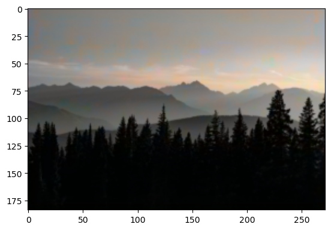
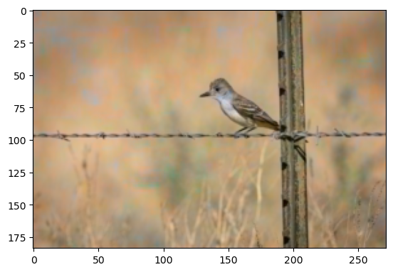
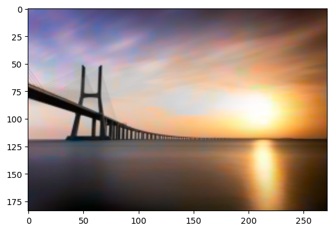
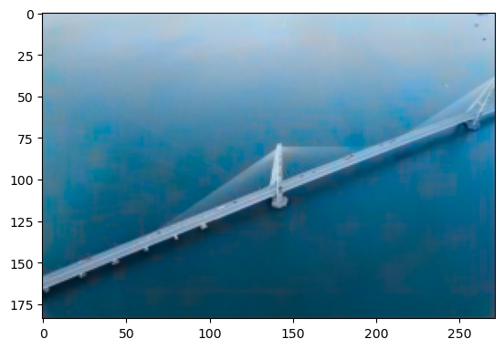
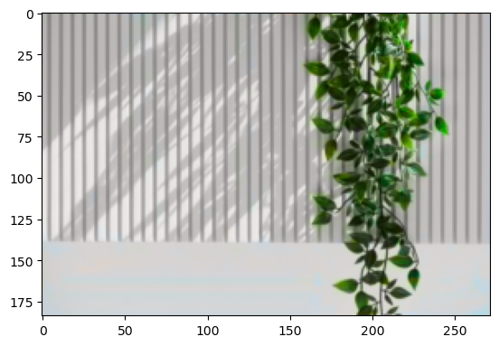
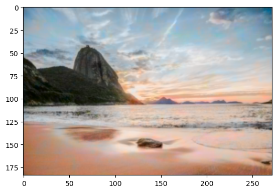
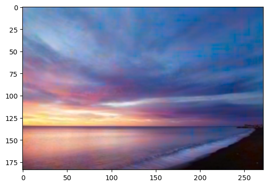

> 封面来源 [Unsplash](https://unsplash.com/photos/D_YZmKGSyic)

## 前言

这篇文章是我第一次（准确来说可能是第二次，第一次接触的是KMeans聚类算法，但未深入学习）接触AI所阅读的文章，原文其实已经十分详实了，但是对于初学者（我）来说还是有很多当时并不理解的地方，而且原文没有任何拓展阅读以及参考文献，导致整个学习过程异常艰难，只能自己去问身边的大佬或者找paper来看。下面对该篇文章从初学者的角度对一些内容作一些我任务必要的注释。

所有代码我已上传到Github：[ThankRain/image_render: 🎨黑白图片上色 (github.com)](https://github.com/ThankRain/image_render/tree/dev)

> 本文指的初学者为从未接触过AI相关内容但有Python基本的语法基础

> 简单提要：本文涉及到的内容有：Python、TensorFlow、U-Net模型

> 强烈建议安装[Anaconda](https://www.anaconda.com/)用于Python的版本管理
>
> 为了更好的训练模型，建议有 NVIDIA 显卡的同学先学习如何[在TensorFlow中使用GPU](https://tensorflow.google.cn/install/gpu?hl=zh-cn)

## 关于模型

文章定义了以下模型：

```python
def build_model():
    model = Sequential()
    model.add(InputLayer(input_shape=(None, None, 1)))
    model.add(Conv2D(8, (3, 3), activation='relu', padding='same', strides=2))
    model.add(Conv2D(8, (3, 3), activation='relu', padding='same'))
    model.add(Conv2D(16, (3, 3), activation='relu', padding='same'))
    model.add(Conv2D(16, (3, 3), activation='relu', padding='same', strides=2))
    model.add(Conv2D(32, (3, 3), activation='relu', padding='same'))
    model.add(Conv2D(32, (3, 3), activation='relu', padding='same', strides=2))
    model.add(UpSampling2D((2, 2)))
    model.add(Conv2D(32, (3, 3), activation='relu', padding='same'))
    model.add(UpSampling2D((2, 2)))
    model.add(Conv2D(16, (3, 3), activation='relu', padding='same'))
    model.add(UpSampling2D((2, 2)))
    model.add(Conv2D(2, (3, 3), activation='tanh', padding='same'))
    model.compile(optimizer='rmsprop', loss='mse')
    return model
```

文章并未对其进行解释，只有一句：

> 整个过程非常简单，也不愧是我们的simple版本，相信你应该一目了然。如果你觉得过于简单，那么后面会有更加复杂的版本。我们训练6000次，同时把模型保存一下，后面再预测的时候会load整个模型。

当时我看到这句话的表情是这样的：


首先，我尝试从代码的角度来理解这个模型：通过多次逐渐增加卷积深度的卷积，随后进行反向的上采样和反向卷积，最后设置一下优化器和损失函数。模型的大概意思就是这样，具体可以去搜搜 Conv2D 和 UpSampling2D，这里不做过多解释。但问题是，为什么要这么干？我不明白，原作者说了：`一目了然`

## 问题1：什么是卷积

不明白，首先得去找，虽然我知道卷积函数是什么，但是我完全无法与这里的卷积联系起来，那就先去把卷积搞明白。这个视频基本上能够解决我的第一个问题

[从“卷积”、到“图像卷积操作”、再到“卷积神经网络”，“卷积”意义的3次改变](https://www.bilibili.com/video/BV1VV411478E)

`BV1VV411478E`

简单来说，神经网络里的卷积就是一个提取特征的工具，但是Conv2D函数中只定义了卷积核的大小而没有定义卷积核的具体值，在我的理解中，卷积核的具体值便是模型需要去学习的内容，通过不断改变卷积核来提取图像的不同特征，最终达到我们所需求的图像特征。

## 问题2：这个模型的算法叫什么

虽然简单知道了卷积的原理，但是我仍旧不明白为什么模型要这么写。终于，在我翻阅多篇博客和Paper以后，终于在这篇Paper中（[Unpaired Image-to-Image Translation using Cycle-Consistent Adversarial Networks](https://arxiv.org/abs/1703.10593)）找到了这个模型的名字：U-Net（U型网）

更多具体的细节可以去搜一下别的大佬写的文章，以及最初提出U-Net的Paper（[[1505.04597\] U-Net: Convolutional Networks for Biomedical Image Segmentation](https://arxiv.org/abs/1505.04597)），不过U - Net工作原理目前我也不是特别清晰，就暂不进行解读了，有兴趣的UU可以自行研究。


## 问题3：多图片集如何训练

原文的训练集只有一张图片，导致最终训练出来的模型只能预测该图片，当我想要喂多张图片给模型的时候遇到了很多困难（初学对框架和模型的工作原理都不清晰，只能慢慢尝试）

首先就是该模型限制了图片的尺寸，不同尺寸的图片无法投喂，因此我在获取训练集的代码上加入了获取文件夹下所有图片&重新Resize图片为指定尺寸：

```python
import os

import numpy as np
from keras.layers import Conv2D, UpSampling2D, InputLayer
from keras.models import Sequential
from keras.utils import img_to_array, load_img
from matplotlib import pyplot
from skimage.color import rgb2gray, rgb2lab, lab2rgb
from skimage.io import imsave
h = 272#训练数据集图片高度
w = 184#训练数据集图片高度
oh = h#上色测试图片高度
ow = w#上色测试图片宽度，尽量与训练尺寸保持一致，否则上色效果会很差
from skimage.transform import resize
# 获取训练用图片数据集
def get_trains():
    path = "data/Train"  # 文件夹目录
    files = os.listdir(path)  # 得到文件夹下的所有文件名称
    xx = np.empty((file_count(), w, h, 1))
    yy = np.empty((file_count(), w, h, 2))
    i = 0
    for file in files:  # 遍历文件夹
        if not os.path.isdir(file):  # 判断是否是文件夹，不是文件夹才打开
            # img
            print(path + "/" + file)  # 打印结果
            image = img_to_array(load_img(path + "/" + file))
            dst_size = (w, h)
            image = resize(image, dst_size)
            image_shape = image.shape
            x = rgb2lab(1.0 / 255 * image)[:, :, 0]
            y = rgb2lab(1.0 / 255 * image)[:, :, 1:]
            y /= 128
            x = x.reshape(image_shape[0], image_shape[1], 1)
            y = y.reshape(image_shape[0], image_shape[1], 2)
            xx[i] = x
            yy[i] = y
            i += 1
    return xx, yy
```

获取验证数据集（这里的验证数据集与训练数据集相同，未单独使用不同的测试数据集）：

```python
def get_trains_origin():
    path = "data/Train"  # 文件夹目录
    files = os.listdir(path)  # 得到文件夹下的所有文件名称
    xx = np.empty((file_count(), ow, oh, 1))
    yy = np.empty((file_count(), ow, oh, 2))
    i = 0
    for file in files:  # 遍历文件夹
        if not os.path.isdir(file):  # 判断是否是文件夹，不是文件夹才打开
            # img
            print(path + "/" + file)  # 打印结果
            image = img_to_array(load_img(path + "/" + file))
            dst_size = (ow, oh)
            image = resize(image, dst_size)
            image_shape = image.shape
            x = rgb2lab(1.0 / 255 * image)[:, :, 0]
            y = rgb2lab(1.0 / 255 * image)[:, :, 1:]
            y /= 128
            x = x.reshape(image_shape[0], image_shape[1], 1)
            y = y.reshape(image_shape[0], image_shape[1], 2)
            xx[i] = x
            yy[i] = y
            i += 1
    return xx, yy
```


模型函数基本未作修改，只加入了宽高限制（也可以用None去掉，用途不大但懒得修改）

```python
def build_model(hh,ww):
    model = Sequential()
    model.add(InputLayer(input_shape=(ww, hh, 1)))
    model.add(Conv2D(8, (3, 3), activation='relu', padding='same', strides=2))
    model.add(Conv2D(8, (3, 3), activation='relu', padding='same'))
    model.add(Conv2D(16, (3, 3), activation='relu', padding='same'))
    model.add(Conv2D(16, (3, 3), activation='relu', padding='same', strides=2))
    model.add(Conv2D(32, (3, 3), activation='relu', padding='same'))
    model.add(Conv2D(32, (3, 3), activation='relu', padding='same', strides=2))
    model.add(UpSampling2D((2, 2)))
    model.add(Conv2D(32, (3, 3), activation='relu', padding='same'))
    model.add(UpSampling2D((2, 2)))
    model.add(Conv2D(16, (3, 3), activation='relu', padding='same'))
    model.add(UpSampling2D((2, 2)))
    model.add(Conv2D(2, (3, 3), activation='tanh', padding='same'))
    model.compile(optimizer='rmsprop', loss='mse')
    return model
```

训练函数修改为：

```python
def train():
    xx, yy = get_trains()
    model0 = build_model(h,w)
    num_epochs = 6000
    batch_size = 6
    model_file = 'simple_model.h5'
    model0.load_weights(model_file)
    print(xx.shape,yy.shape)
    print(h,w)
    model0.fit(xx, yy, batch_size=file_count(), epochs=10000)
    model0.save(model_file)
```

上色函数：

```python
def colorize():
    x, y = get_trains_origin()
    model = build_model(oh,ow)
    model.load_weights('simple_model.h5')
    output = model.predict(x)
    print(output.shape, x.shape, y.shape)
    output *= 128
    for i in range(file_count()) :
        tmp = np.zeros((ow, oh, 3))
        tmp[:, :, 0] = x[i, :, :, 0]
        tmp[:, :, 1:] = output[i,:, :, :]
        imsave("test_image_result.png", lab2rgb(tmp))
        imsave("test_image_gray.png", rgb2gray(lab2rgb(tmp)))
        pyplot.imshow(lab2rgb(tmp))
        pyplot.show()
```

最终训练效果图（请自行脑补灰度图）：



这里只简单摘了几张图片。由于性能问题，训练的图片大小都比较小，看着比较模糊，但整体效果不错。

完整代码：

[ThankRain/image_render: 🎨黑白图片上色 (github.com)](https://github.com/ThankRain/image_render)

在 Colab 中打开（由于里面包含有24张上色结果图片导致文件较大，加载可能会比较慢）：

[index.ipynb - Colaboratory (google.com)](https://colab.research.google.com/github/ThankRain/image_render/blob/38e155937805b7269d05655cf204a624e8ac943b/index.ipynb#scrollTo=TrVudyZ16w9v)

## 参考文献

1. [自己实现黑白图片自动上色AI（一） - 知乎 (zhihu.com)](https://zhuanlan.zhihu.com/p/30493746)

2. [[1703.10593\] Unpaired Image-to-Image Translation using Cycle-Consistent Adversarial Networks (arxiv.org)](https://arxiv.org/abs/1703.10593)
3. [[1505.04597\] U-Net: Convolutional Networks for Biomedical Image Segmentation (arxiv.org)](https://arxiv.org/abs/1505.04597)
4. [junyanz/pytorch-CycleGAN-and-pix2pix: Image-to-Image Translation in PyTorch (github.com)](https://github.com/junyanz/pytorch-CycleGAN-and-pix2pix)
5. [从“卷积”、到“图像卷积操作”、再到“卷积神经网络”，“卷积”意义的3次改变 (bilibili.com)](https://www.bilibili.com/video/BV1VV411478E)