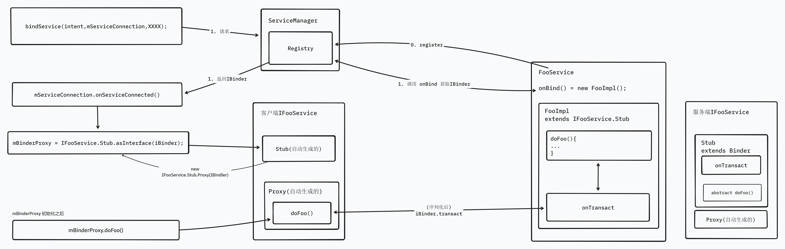

## Binder 是什么

也许你已经看过许多篇文章讲 AIDL、Binder 是什么但是仍然摸不着头脑，也搞不清楚什么 Stub、Proxy、IBinder等等是是什么，但是一提到 App 与服务器通信的接口与接口风格，你也许马上能够想到 RESTful、GraphQl、gRPC 等一系列内容，下文将通过与 gRPC 类比的带你理解 Binder 中各部分分别是什么。

## gRPC 与 Protobuf


> 在介绍 Binder 之前，我想先简单介绍一下 gRPC 是什么，这对于后续的类比介绍十分重要。如果你已经知道 gRPC 与 protobuf，那么这一节可以直接跳过。

简单来说，[gRPC](https://grpc.io/) (Google Remote Procedure Call) 是Google开发的一个 RPC 框架，用于客户端直接调用服务端提供的函数，说白了就是一种 API 接口的设计方法，跟 RESTful、GraphQL 一样都只是一个 API 接口框架，gRPC 的优势是使用 *[ProtoBuf  ](https://protobuf.dev/)*作为接口描述、数据交换的格式（RESTful 风格的接口通常使用的是 JSON），而 ProtoBuf 的优势是快、小、平台无关，相较于 JSON 来说使用数据二进制格式封装，结构更紧凑，更易解析，同时通过 protobuf 只需要描述接口与对象，即可自动生成所需语言的数据类与接口，服务端只需要实现生成代码中的接口即可提供服务，客户端只需要初始化时指定服务器的 URL 即可像调用本地函数一样调用服务器的接口。

下面引用 <https://www.cnblogs.com/zhangmingcheng/p/16329237.html> 的例子：

我们可以简单定义一个 protobuf 文件

```
syntax = "proto3";
// 这部分的内容是关于最后生成的go文件是处在哪个目录哪个包中，../pb代表在当前目录的上一级pb目录中生成，message代表了生成的go文件的包名是message。
option go_package = "../pb;pb";
 
message MessageResponse {
  string responseSomething = 1;
}
 
message MessageRequest {
  string saySomething = 1;
}
 
service MessageSender {
  rpc Send(MessageRequest) returns (MessageResponse) {}
}
```

很容易可以看出，我们定义了一个service，称为MessageSender，这个服务中有一个rpc方法，名为Send。这个方法会发送一个MessageRequest，然后返回一个MessageResponse。

随后我们可以使用 protobuf 提供的命令行工具自动生成代码，代码生成以后服务端只需要实现以下代码：

```go
// grpc-practice/pkg/serviceImpl/MessageSenderServerImpl.go
package serviceImpl
 
import (
    "context"
    "grpc-practice/pkg/pb"
    "log"
)
 
type MessageSenderServerImpl struct {
    *pb.UnimplementedMessageSenderServer
}
 
func (MessageSenderServerImpl) Send(context context.Context, request *pb.MessageRequest) (*pb.MessageResponse, error) {
    log.Println("receive message:", request.GetSaySomething())
    resp := &pb.MessageResponse{}
    resp.ResponseSomething = "roger that!"
    return resp, nil
}  
```

```go
// grpc-practice/pkg/service/main.go
 
package main
 
import (
    "google.golang.org/grpc"
    "grpc-practice/pkg/pb"
    "grpc-practice/pkg/serviceImpl"
    "log"
    "net"
)
 
func main() {
    srv := grpc.NewServer()
    pb.RegisterMessageSenderServer(srv,serviceImpl.MessageSenderServerImpl{})
    listener, err := net.Listen("tcp", ":8002")
    if err != nil {
        log.Fatalf("failed to listen: %v", err)
    }
 
    err = srv.Serve(listener)
    if err != nil {
        log.Fatalf("failed to serve: %v", err)
    }
}
```

即可创建一个简单的 gRPC 服务器，而客户端使用该 protobuf 文件也可以快速生成代码，能够让客户端调用接口如同调用本地方法一样：

```go
// grpc-practice/pkg/client/main.go
 
package main
 
import (
    "context"
    "google.golang.org/grpc"
    "grpc-practice/pkg/pb"
    "log"
)
 
func main() {
    conn, err := grpc.Dial("127.0.0.1:8002",grpc.WithInsecure())
    if err != nil {
        log.Fatalf("did not connect: %v", err)
    }
    defer conn.Close()
 
    client := pb.NewMessageSenderClient(conn)
    resp, err := client.Send(context.Background(), &pb.MessageRequest{SaySomething: "hello world!"})
    if err != nil {
        log.Fatalf("could not greet: %v", err)
    }
    log.Println("receive message:", resp.GetResponseSomething())
}
```

使用其他语言也是一样，如使用客户端使用 Rust：

```rust
#[tokio::main]
async fn main() -> Result<(), Box<dyn std::error::Error>> {
    let addr = Endpoint::from_static("https://127.0.0.1:8002");

    let mut client = MessageSenderClient::connect(addr.clone()).await?;
    let request = Request::new(MessageRequest {
        say_something: "tonic".to_string(),
    });
    let response = client.send(request).await?;
    println!("response: {:?}", response.into_inner());
    
    Ok(())
}
```

可以看到使用 gRPC 不需要使用大量的代码构建 HTTP 请求，解析响应，整套请求流程与调用对象的函数几乎一样，大大简化了客户端与服务器通信接口的实现（这一切主要靠 protobuf 自动生成的代码来实现）

## Binder 与 AIDL

简单来说，Binder是 Android 进程间通信 IPC (Inter-Process Communication) 的一种协议/机制，可以理解为进程间通信的 gRPC 协议。而 AIDL(Android Interface Definition Language) 就是 Binder 中的 protobuf，负责定义接口。


1. 我们可以使用 AIDL 定义一个接口，相当于 gRPC 使用 protobuf 定义接口：

   ```text
       package my.package;
       interface IFoo {
           int doFoo();
       }
   ```
2. 接着Rebuild一下项目后IDE就会自动生成由 aidl 文件生成桩代码，相当于通过 protobuf 文件生成接口定义文件和抽象，其生成的代码大致为以下结构：

   ```java
   public interface IFooService extends android.os.IInterface {
   
     public int doFoo() throws android.os.RemoteException { 
       ...
     }
     
     // Stub是一个Binder，相当于上一章中的GradeBinder
     public static abstract class Stub extends android.os.Binder implements IFooService {
         
         public static IFooService asInterface(android.os.IBinder obj) {
           if ((obj == null)) {
             return null;
           }
           android.os.IInterface iin = obj.queryLocalInterface(DESCRIPTOR);
           if (((iin != null) && (iin instanceof IFooService))) {
             // 如果是当前进程则直接返回当前 Binder 对象
             return ((IFooService) iin);
           }
           // 跨进程则返回Binder的代理对象
           return new IFooService.Stub.Proxy(obj);
         }
         
         @Override
         public boolean onTransact(int code, android.os.Parcel data, android.os.Parcel reply, int flags){
           ...
         } 
         
         @Override 
         public android.os.IBinder asBinder() {
           return this;
         }
   
     }
     
     private static class Proxy implements IFooService {
       private android.os.IBinder mRemote;
           
       Proxy(android.os.IBinder remote) {
         mRemote = remote;
       }
       
       @Override 
       public int doFoo() throws android.os.RemoteException { 
         ...
       }
       
       @Override 
       public android.os.IBinder asBinder() {
         return mRemote;
       }
     }
   }
   ```
3. 服务端继承实现 IFoo.Stub 抽象类，等价于 gRPC 实现接口具体的处理

   ```java
       import my.package.IFoo;
       public class MyFoo extends IFoo.Stub {
           @Override
           int doFoo() { ... }
       }
   ```
4. 编写服务

   ```java
   public class MyService extends Service {
   
       public static final int REQUEST_CODE=1000;
   
       @Nullable
       @Override
       public IBinder onBind(Intent intent) {
           return new MyFoo();
       }
   }
   ```
5. 注册服务，等价于 gRPC 服务端监听端口提供服务

   ```java
   import android.os.ServiceManager;
   // registering
   ServiceManager.addService("service-name", myService);
   ```
6.  客户端绑定 Service 并调用，绑定 Service 相当于 gRPC 中客户端连接服务端

   ```java
   public class AidlActivity extends BaseViewBindingActivity<ActivityBinderBinding> {
   
       private IFooService mBinderProxy;
   
       private final ServiceConnection mServiceConnection = new ServiceConnection() {
           @Override
           public void onServiceConnected(ComponentName componentName, IBinder iBinder) {
               // 连接服务后，根据是否跨进程获取Binder或者Binder的代理对象
               mBinderProxy = IFooService.Stub.asInterface(iBinder);
           }
   
           @Override
           public void onServiceDisconnected(ComponentName componentName) {
               mBinderProxy = null;
           }
       };
   
       @Override
       protected void onCreate(Bundle savedInstanceState) {
           super.onCreate(savedInstanceState);
           binding.btnBindService.setOnClickListener(view -> bindGradeService());
           binding.btnFindGrade.setOnClickListener(view -> getFoo());
       }
     
       // 绑定服务
       private void bindGradeService() {
           String action = "android.intent.action.server.aidl.gradeservice";
           Intent intent = new Intent(action);
           intent.setPackage(getPackageName());
           bindService(intent, mServiceConnection, BIND_AUTO_CREATE);
       }
     
       private void getFoo() {
           int grade = 0;
           try {
               bar = mBinderProxy.doFoo();
           } catch (RemoteException e) {
               e.printStackTrace();
           }
       }
   }
   ```

以上代码基本将 Binder 与 gRPC 中的内容对应起来，相信对于理解 Binder 以及 AIDL 是什么，怎么用已经有了一个初步的认识，接下来就是 AIDL 中生成的代码中各内容是什么

## AIDL 生成的都是些什么

那么 AIDL 生成的代码中的IFooService, IInterface, Stub, Proxy…都是些什么呢？

### IFooService

`IFooService` 应该是最清晰的一个，他就是由我们定义的 AIDL 代码中的 `interface IFoo`，里面有我们定义的接口 `int doFoo();`，而 `IFooService` 继承了 `IInterface`，而他的定义很简单：

```java
/**
 * Base class for Binder interfaces.  When defining a new interface,
 * you must derive it from IInterface.
 */
public interface IInterface
{
    /**
     * Retrieve the Binder object associated with this interface.
     * You must use this instead of a plain cast, so that proxy objects
     * can return the correct result.
     */
    public IBinder asBinder();
}
```

只定义了一个 asBinder 方法，而该方法在 Stub 类和 Proxy 类中分别实现，用于使接口能返回相关联的Binder。

### Stub

Stub 是一个抽象类，继承了 `Binder`，实现了 `IFooService`，用户实际的接口代码也是后续通过继承 Stub 实现的，所以实现 `IFooService` 接口是很自然的，`Stub` 中生成的 `asInterface` 方法用于客户端中将获取到的实现了 `IBinder` 接口的对象强制转型为(可以理解为反序列化)为实现了 `IFooService` 的对象

### Binder 与 IBinder

[Binder](https://android.googlesource.com/platform/frameworks/base/+/master/core/java/android/os/Binder.java) 类实现了 [IBinder](https://android.googlesource.com/platform/frameworks/base/+/master/core/java/android/os/IBinder.java) 接口，其中最关键的代码是实现了 `transact` 方法：

```java
public class Binder implements IBinder {

    ...
    
    /**
     * Default implementation rewinds the parcels and calls onTransact. On
     * the remote side, transact calls into the binder to do the IPC.
     */
    public final boolean transact(int code, @NonNull Parcel data, @Nullable Parcel reply,
            int flags) throws RemoteException {
        if (false) Log.v("Binder", "Transact: " + code + " to " + this);
        if (data != null) {
            data.setDataPosition(0);
        }
        // 简单判断后调用 onTransact
        boolean r = onTransact(code, data, reply, flags);
        if (reply != null) {
            reply.setDataPosition(0);
        }
        return r;
    }
    
    protected boolean onTransact(int code, @NonNull Parcel data, @Nullable Parcel reply,
            int flags) throws RemoteException {
        if (code == INTERFACE_TRANSACTION) {
            reply.writeString(getInterfaceDescriptor());
            return true;
        } else if (code == DUMP_TRANSACTION) {
            ParcelFileDescriptor fd = data.readFileDescriptor();
            String[] args = data.readStringArray();
            if (fd != null) {
                try {
                    dump(fd.getFileDescriptor(), args);
                } finally {
                    IoUtils.closeQuietly(fd);
                }
            }
            // Write the StrictMode header.
            if (reply != null) {
                reply.writeNoException();
            } else {
                StrictMode.clearGatheredViolations();
            }
            return true;
        } else if (code == SHELL_COMMAND_TRANSACTION) {
            ParcelFileDescriptor in = data.readFileDescriptor();
            ParcelFileDescriptor out = data.readFileDescriptor();
            ParcelFileDescriptor err = data.readFileDescriptor();
            String[] args = data.readStringArray();
            ShellCallback shellCallback = ShellCallback.CREATOR.createFromParcel(data);
            ResultReceiver resultReceiver = ResultReceiver.CREATOR.createFromParcel(data);
            try {
                if (out != null) {
                    shellCommand(in != null ? in.getFileDescriptor() : null,
                            out.getFileDescriptor(),
                            err != null ? err.getFileDescriptor() : out.getFileDescriptor(),
                            args, shellCallback, resultReceiver);
                }
            } finally {
                IoUtils.closeQuietly(in);
                IoUtils.closeQuietly(out);
                IoUtils.closeQuietly(err);
                // Write the StrictMode header.
                if (reply != null) {
                    reply.writeNoException();
                } else {
                    StrictMode.clearGatheredViolations();
                }
            }
            return true;
        }
        return false;
    }
}
```

而 `transact` 方法实际上在 Proxy 类的 `doFoo` 方法中调用：

```java
  private static class Proxy implements IFooService {
    @Override 
    public int doFoo() throws android.os.RemoteException { 
        android.os.Parcel _data = android.os.Parcel.obtain();
        android.os.Parcel _reply = android.os.Parcel.obtain();
        int _result;
        try {
          _data.writeInterfaceToken(DESCRIPTOR);
          // _data.writeString(something); 如果接口有传入参数的话会使用类似的方法将参数写入 _data
          // 在此处调用
          boolean _status = mRemote.transact(Stub.TRANSACTION_doFoo, _data, _reply, 0);
          if (!_status && getDefaultImpl() != null) {
            return getDefaultImpl().doFoo();
          }
          _reply.readException();
          _result = _reply.readInt();
        } finally {
          _reply.recycle();
          _data.recycle();
        }
        return _result;
    }
    
    @Override 
    public android.os.IBinder asBinder() {
      return mRemote;
    }
  }
```

而当跨进程调用时客户端通过 asInterface 获取到的 `IFooService` 对象正是 `Proxy`：

```java
  public static abstract class Stub extends android.os.Binder implements IFooService {
      
      public static IFooService asInterface(android.os.IBinder obj) {
        if ((obj == null)) {
          return null;
        }
        android.os.IInterface iin = obj.queryLocalInterface(DESCRIPTOR);
        if (((iin != null) && (iin instanceof IFooService))) {
          // 如果是当前进程则直接返回当前Binder对象
          return ((IFooService) iin);
        }
        // 跨进程则返回Binder的代理对象
        return new IFooService.Stub.Proxy(obj);
      }
  }
```

至此，全流程已经跑通了。`IBinder` 的作用更像是建立了一个进程间的连接，所有的调用都经过 `Proxy` 类中的方法序列化(使用 Parcel)，然后由 IBinder 这个连接所提供的 `transact` 方法传递到服务端，服务端通过 Stub 方法的 `onTransact` 进行反序列化，并调用 Stub 方法下的 `doFoo()` 方法获取返回结果（该方法为抽象方法，需服务端继承实现），最后将返回值通过 `transact` 方法返回到客户端，由客户端 `Proxy.doFoo` 完成后续的返回值反序列化，最终返回给客户端。

全流程图：

 

## Binder 原理

相信到这里你已经对 Binder 是什么以及其工作流程图已经有了大概的了解，此时再回过头去看 Binder 的实现原理也会更加轻松，有很多其他文章讲解原理已经十分清晰了，这里就不再赘述，可以参考这篇文章：

[Android : 跟我学Binder --- (1) 什么是Binder IPC？为何要使用Binder机制？](https://www.cnblogs.com/blogs-of-lxl/p/10088548.html)

## References


1. [AIDL 后端](https://source.android.com/docs/core/architecture/aidl/aidl-backends?hl=zh-cn)
2. **[不得不说的 Android Binder 机制与 AIDL](https://juejin.cn/post/6994057245113729038)**
3. [Android跨进程通信：图文详解 Binder 机制原理](https://blog.csdn.net/carson_ho/article/details/73560642)