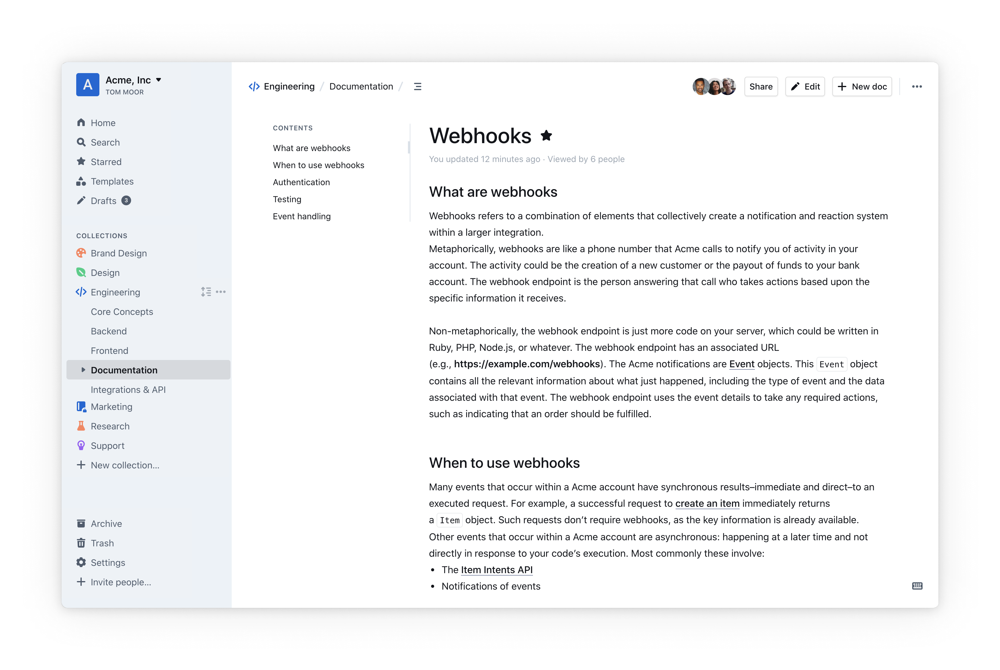
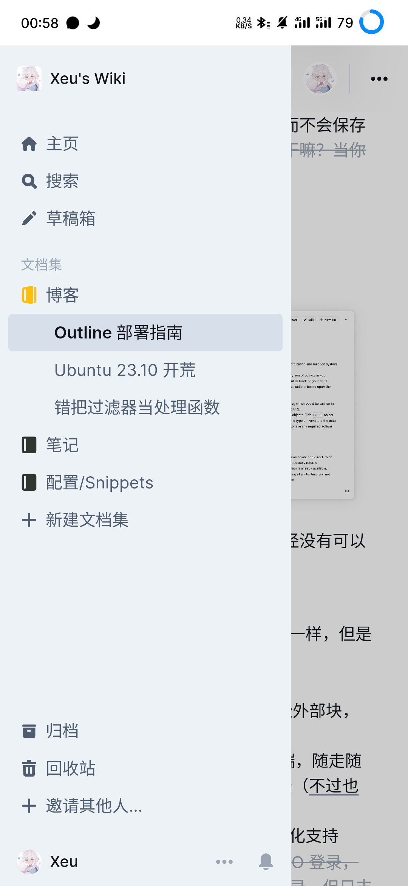
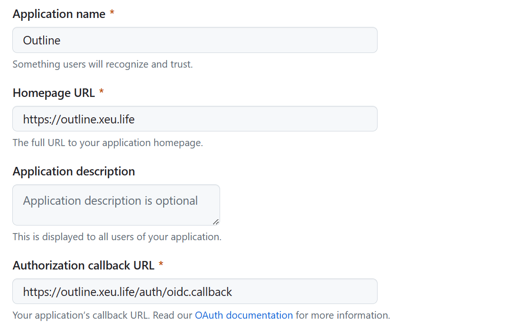
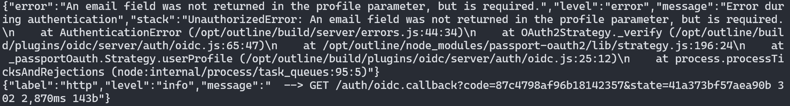
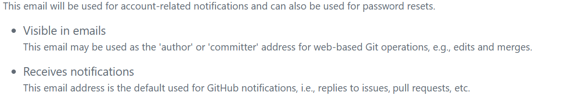
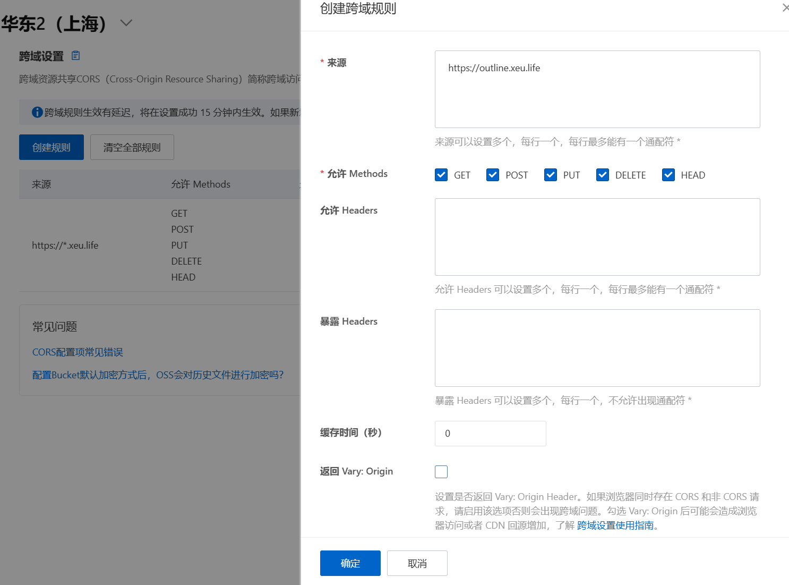
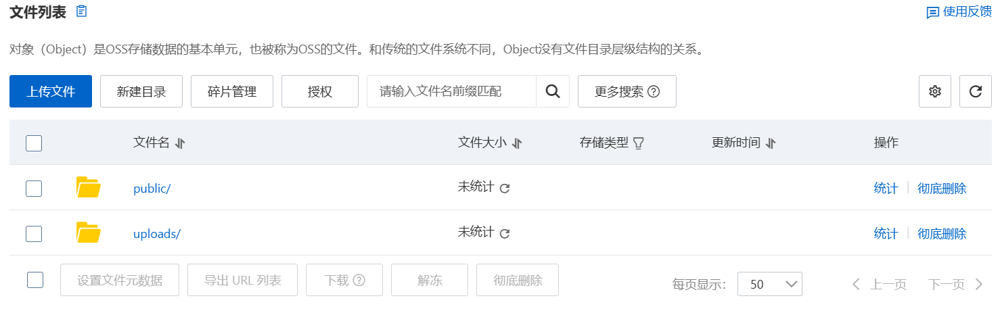
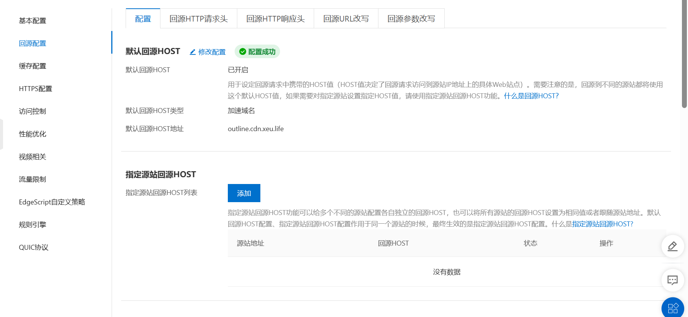
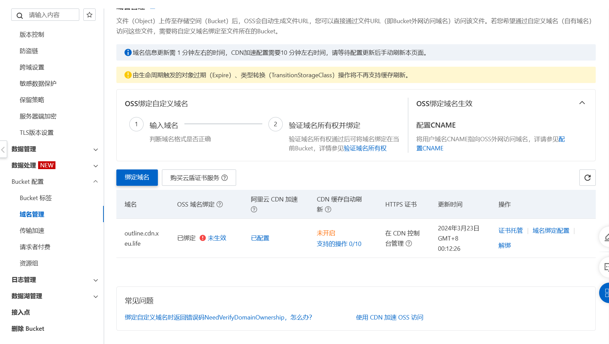
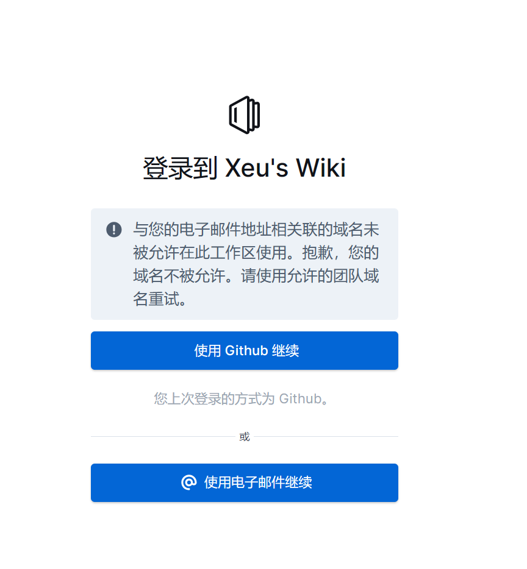

---
aliases:
- /feed/10/
- /outline/
categories:
- tech
date: 2024-03-22T00:38:00.000Z
description: 由于经常折腾，扬系统跟吃饭喝水一样频繁，而我之前的 Obsidian 配合 Git 同步使用，虽然不用担心数据丢失，但是每次扬完系统后都需要拉取仓库 & 下载 Obsidian 客户端...
draft: false
image: 34cd8a8df338b2dbde4e1fd8.png
lastmod: 2026-01-15T15:58:14.000Z
slug: outline-deployment-guide
tags: []
title: Outline 部署指南
---
>[!NOTE]
全文约 6000 字，阅读约需要 8 分钟

# 背景介绍

由于经常折腾，扬系统跟吃饭喝水一样频繁，而我之前的 Obsidian 配合 Git 同步使用，虽然不用担心数据丢失，但是每次扬完系统后都需要拉取仓库 & 下载 Obsidian 客户端，次数一多就开始厌烦了，特别是想记点什么东西的时候发现还要去拉仓库，下客户端，就立马失去了动力，于是最近一直在寻找好用的 Obsidian/Notion/飞书 **替代品**，既要有基础的功能，又能够支持 Web 即开即用，同时最好能够自托管，还能快速通过链接分享一些内容。找来找去，找到了三个候选项目：[Appflowy](https://github.com/AppFlowy-IO/AppFlowy), [Affine](https://github.com/toeverything/AFFiNE), [Outline](https://github.com/outline/outline)，多次比较之后最终选择了 Outline


# [Outline](https://github.com/outline/outline)




现在，三款产品已经排除了两个已经没有可以选择的了

先介绍下 Outline 有哪些特性：

* 支持团队多人在线协同（跟飞书一样，但是我用不上）
* 支持快速分享链接到互联网上
* 支持 Markdown，可以引用一些外部块，以及一堆好用的快捷键
* Web UI，适配了移动端与桌面端，随走随用，支持PWA，不用下载客户端（[不过也有桌面客户端提供](https://www.getoutline.com/download)）




* 支持简体中文，拥有完整的本地化支持
* 支持 SSO 登录 ~~但也只支持 SSO 登录，SSO登录成功后可以开启邮箱登录，但只支持已经使用SSO登录过的用户，并且并不是通过邮箱+密码，而是填写邮箱发送登录链接到邮箱中~~
* 支持按文档集设置其他用户可见权限
* 支持文档评论，子文档
* 内容自动保存，历史记录
* 支持根据不同的事件触发 Webhook 

简单来说，这是一个开源的，可自托管的开源飞书文档

但是在尝试部署 Outline 的时候也是吃尽了苦头，整个部署会非常的麻烦，不过最终体验确实能够值回部署付出的精力，长达两百多行的环境变量配置文件（虽然大多是注释，但若只是想尽快尝试看到效果来说配置起来也着实痛苦，并且还要不断根据错误调整修改配置文件），只支持 SSO 登录而不支持账号密码登录，而直接适配的 SSO 登录只有 Slack, Google ~~(Workspace)~~, Azure 等少数团队协作平台，同时很呆的OIDC配置也是导致也是踩了不少坑。本篇记录一下我在部署 Outline 途中踩的坑和问题，给后续想要自托管 Outline 的小伙伴提供一个参考。


## Docker Compose部署

这里贴上我的Dockers Compose部署配置文件，是根据官方提供的 [docker-compose.yml](https://docs.getoutline.com/s/hosting/doc/docker-7pfeLP5a8t) 文件修改而来，主要修改是将 默认的反向代理服务替换为了我一直使用的 traefik 反向代理需要的配置，同时将所有的 volumes 修改为了相对路径，如果你之前没有配置过 traefik 的话，我建议直接使用官方提供的配置文件

```css
version: "3.2"
services:
  outline:
    image: outlinewiki/outline:latest
    env_file: ./docker.env
    # labels 用于配置 traefik 的路由，如果你使用别的反向代理服务可以直接忽略
    labels:
      - "traefik.http.routers.outline.rule=Host(`outline.xeu.life`)"
      - "traefik.enable=true"
      - "traefik.http.routers.outline.entrypoints=https"
      - "traefik.http.routers.outline.tls=true"
      - "traefik.http.routers.outline.tls.certresolver=mresolver"
    expose:
      # traefik 不关心服务对外暴露的端口，所以这里使用了 expose，如果没有反向代理可以改成 ports 进行端口映射
      - "3000"
    networks:
      # traefik 需要服务处于同一网络下，如果不使用 taefik 可删除，后面两个服务的 networks 也是一样
      - nets
    volumes:
      - ./storage-data:/var/lib/outline/data
    depends_on:
      - postgres
      - redis

  redis:
    image: redis
    env_file: ./docker.env
    ports:
      - "6379:6379"
    volumes:
      - ./redis.conf:/redis.conf
    networks:
      - nets
    command: ["redis-server", "/redis.conf"]
    healthcheck:
      test: ["CMD", "redis-cli", "ping"]
      interval: 10s
      timeout: 30s
      retries: 3

  postgres:
    image: postgres
    env_file: ./docker.env
    ports:
      - "5432:5432"
    volumes:
      - ./database-data:/var/lib/postgresql/data
    healthcheck:
      test: ["CMD", "pg_isready -d outline -U user"]
      interval: 30s
      timeout: 20s
      retries: 3
    networks:
      - nets
    environment:
      POSTGRES_USER: 'user'
      POSTGRES_PASSWORD: 'pass'
      POSTGRES_DB: 'outline'

networks:
  nets:
    external:
      # 外部预创建的 docker network 
      name: nets
```

### 环境变量配置

环境变量直接从官方仓库中的 [.env.sample](https://github.com/outline/outline/blob/main/.env.sample) 复制，并根据自己的情况进行修改，里面的注释已经比较详细了，这里不再赘述，下文重点提一下 Github OIDC 接入和文件存储接入。

## 接入 SSO

由于 Outline 提供的几个平台我都不怎么使用，唯一尝试了常使用的 Google 登录以后才知道 Outline 不支持个人账号使用 Google 登录，必须是 Google Workspace 的用户，而这个是 Google 的一个团队协同办公服务，开通需要花钱，只能放弃，选择唯一的 OIDC 接入

### 自建 SSO

对于其他 SSO 无法正常登录的情况下可以尝试自己部署一个 SSO 服务接入，具体可以参考以下博客

<https://www.luckzym.com/posts/a239536c/>，这里就不再赘述了


OIDC 理论上来说是 OAuth 2.0 的超集，支持所有 OAuth 的服务，于是我开始尝试接入最方便也是最常用的 Github OAuth

### 接入 Github OAuth

打开 <https://github.com/settings/developers>，选择 `New OAuth App` 创建一个新的 Oauth App，填入自己的应用名称与主页地址(带`http://`或`https://`)，`Authorization callback URL` 填写

```css
https://<你的Outline地址>/auth/oidc.callback
```

这里附上我的参数 



随后配置 `docker.env` 中 OIDC 部分 

以下是具体的配置，`OIDC_CLIENT_ID`填写 Github OAuth App 中的`Client ID`,`OIDC_CLIENT_SECRET`填写在 Github OAuth App 点击 `Generate a new client secret` 后的 `Client secret`，注意每次创建后只展示一次，后续无法查看，如果不慎丢失重新生成一个新的即可

```css
# To configure generic OIDC auth, you'll need some kind of identity provider.
# See documentation for whichever IdP you use to acquire the following info:
# Redirect URI is https://<URL>/auth/oidc.callback
OIDC_CLIENT_ID=<Client ID> 
OIDC_CLIENT_SECRET=<Client secret>
OIDC_AUTH_URI=https://github.com/login/oauth/authorize
OIDC_TOKEN_URI=https://github.com/login/oauth/access_token
OIDC_USERINFO_URI=https://api.github.com/user
OIDC_LOGOUT_URI=

# Specify which claims to derive user information from
# Supports any valid JSON path with the JWT payload
OIDC_USERNAME_CLAIM=name

# Display name for OIDC authentication
OIDC_DISPLAY_NAME=Github

# Space separated auth scopes.
OIDC_SCOPES=read:user user:email
```

到这里按理说就基本上可用了，但是我在使用 Github OAuth 时登录失败，网页只出现一个`!`，并没有错误信息，在日志中查看发现出现`An email field was not returned in the profile parameter, but is required.`错误




这个问题困扰了我好久，通过不断翻 issue 和 discussion 终于找到一个相关的讨论：<https://github.com/outline/outline/pull/2399#issuecomment-916036880>

简单来说就是因为 Outline 使用 OIDC 登录时必须要获取到 email 字段，但是 Github 的隐私邮箱功能会隐藏邮箱导致 Outline 只能获取到 null，解决方案也很简单：关闭隐私邮箱即可（虽然不是很优雅，但是这是目前为止唯一的解决方案，自用的话足够了）


### Github 关闭隐私邮箱

打开 <https://github.com/settings/emails>，取消勾选 `Keep my email addresses private`。我最初以为这样就足够了，因为邮箱列表中已经有了如下提示：
但是问题仍然存在，实际上还需要在 [Profile](https://github.com/settings/profile) 中第二项 `Public email` 选择你的邮箱，并 `Update Profile` 之后 Outline 才能够获取到你的邮箱。


## 存储服务

存储服务我最初使用的腾讯云对象存储服务，腾讯云对象存储支持 AWS S3 协议接入，但是在实际配置好后发现上传失败，在经过排查后发现服务器能够正常与 COS 通信并创建上传文件的申请，但是浏览器发送的上传请求被拒绝了，返回了 403，错误信息为：

```css
Condition key x-cos-algorithm doesn't match the value AWS4-HMAC-SHA256
```

经过一番查找，最终找到这样一篇讨论：<https://github.com/outline/outline/discussions/3159>，简单来说应该是腾讯云 COS 的问题（也可能是我的配置问题，但我没有继续研究下去），虽然讨论中提到腾讯云应该会在未来解决这个问题，但讨论是在 2022 年，而现在是 2024 …，所以只能考虑别的 S3 兼容云服务或者直接使用 `local` 本地存储

而我在使用本地存储的时候也发现上传失败，查看日志发现是没有权限，将存储文件夹权限修改为 777 解决了这个问题。

## 使用阿里云 OSS

考虑到备份的问题，最终还是选择将存储服务迁移到对象存储，而在文档中有明确提到阿里云是支持的，于是开始设置使用阿里云 OSS

阿里云正常创建一个对象存储桶，然后在配置文件中填入以下内容

```ini
AWS_ACCESS_KEY_ID=<Acess Key Id>
AWS_SECRET_ACCESS_KEY=<Secret Access Key>
# 存储桶区域，如：oss-cn-shanghai
AWS_REGION=<region> 
AWS_S3_ACCELERATE_URL=https://<bucket name>.<region>.aliyuncs.com
AWS_S3_UPLOAD_BUCKET_URL=https://<bucket name>.<region>.aliyuncs.com
AWS_S3_UPLOAD_BUCKET_NAME=<bucket name>
AWS_S3_FORCE_PATH_STYLE=false
AWS_S3_ACL=private

# Specify what storage system to use. Possible value is one of "s3" or "local".
# For "local", the avatar images and document attachments will be saved on local disk.
FILE_STORAGE=s3
```

Access Key 和 Secret Access Key 在 <https://ram.console.aliyun.com/users> 创建一个新的子用户，记得勾选对象存储相关的权限，然后创建 **AccessKey** 即可获取。

接下来在对象存储中配置 CORS ，存储桶 > 数据安全 > 跨域设置，创建规则，来源处填写你的 outline 地址，然后允许 Methods 全选确定即可



### 文件迁移

从本地存储迁移到阿里云后，原先的文件都将无法打开，需要前往服务器的本地存储文件夹，即 outline 映射的文件夹（参见上文的 docker-compose.yml 文件定义），在本文中为`./storage-data` ,将其中的内容打包

```ini
cd ./storage-data
zip -r image.zip *
```

然后通过 scp 或者别的方法导出/下载到本地，随便解压到一个文件夹，前往阿里云对象存储的文件列表，点击**上传文件**，点击扫描文件夹，选中你解压出来的uploads或public文件夹（不要直接选中根目录，会导致上传后多一层文件夹），然后上传即可，上传成功后对象存储中的根目录文件列表应该长这样： 


如果你的 public 和 uploads （可能其中有的文件夹不存在，这取决于你之前上传的文件类型）文件夹没有在根目录，而在二级目录（如 `image/uploads` ）那么说明上传的时候选中的是 `image`文件夹，而不是`uploads` 文件夹，删除重新上传即可，上传完成之后原来的图片理论上就能够正常访问了

## 配置 CDN 加速


>[!TIP]
CDN 加速为可选项，可以加速访问 & 一定程度节省分发的流量费用

>[!caution]
与此同时使用 CDN 被攻击时极有可能会产生天价账单，如果你之前从未了解过相关内容，不建议引入 CDN

阿里云创建一个新的 CDN 域名，回源选择OSS回源，选择自己的 outline 存储桶，随后就是常规的 CDN 配置：验证域名、设置 CNAME、申请证书、设置 HTTPS，除此以外有几处需要特别设置的地方：


1. CDN 回源配置中**不需要开启**阿里云OSS**私有Bucket回源**
2. 如果要配置访问控制中的 Referrer 过滤，需要把允许空 Referrer 勾选，因为 Outline 在实际展示图片时使用的是 no-referrer
3. CDN 回源 HOST 选择加速域名



4. 对象存储域名管理中绑定 CDN 的加速域名（不需要设置 CNAME）（这一步主要是统一回源域名）



5. 配置文件中的域名配置为 CDN 的域名

   ```ini
   AWS_S3_ACCELERATE_URL=https://<你的 CDN 加速域名>
   #AWS_S3_ACCELERATE_URL=https://<bucket name>.<region>.aliyuncs.com
   AWS_S3_UPLOAD_BUCKET_URL=https:/<你的 CDN 加速域名>
   #AWS_S3_UPLOAD_BUCKET_URL=https://<bucket name>.<region>.aliyuncs.com
   ```

配置完成后重启容器即可

第3步与第5步主要目的是统一域名，鉴权时域名也被包含在计算范围内，如果域名不一致会导致鉴权不通过无法访问资源

第4步目的是允许使用指定的域名访问存储桶，如果不绑定回源域名的话也会被禁止访问

## 其他操作

### 关闭新用户注册

至此已经能够成功使用 Github OAuth 登录了，但是如果有其它用户获取到你的 Outline 链接，他也能够直接使用 OAuth 成功登录，如果不想要其他用户注册登录的话，在 Outline 设置中 > 安全性 > 域名白名单这里添加一个不存在的域名或者自己的域名即可，其他用户使用 OAuth 登录是只要 Outline 获取到用户的邮件地址没有在该域名白名单中就会禁止登录，已注册用户不受影响（注意白名单为空时会禁用白名单，而不是禁止所有用户注册）

