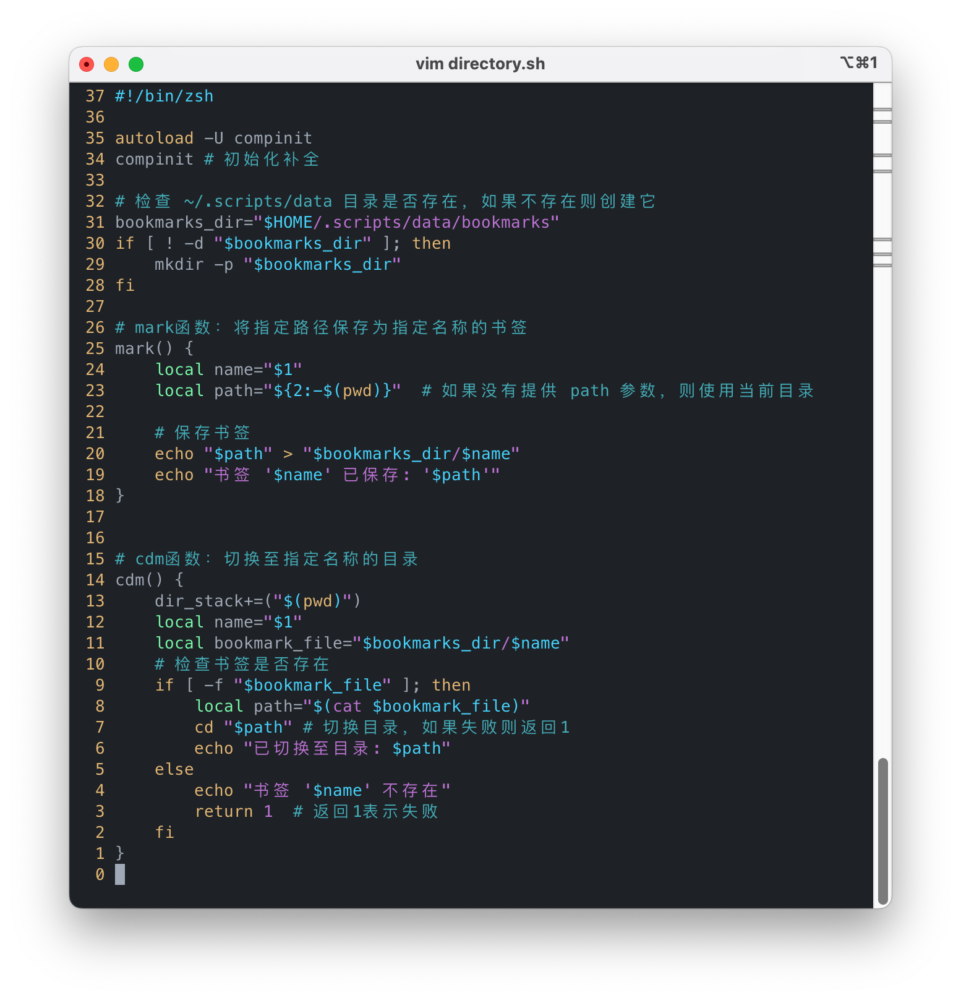
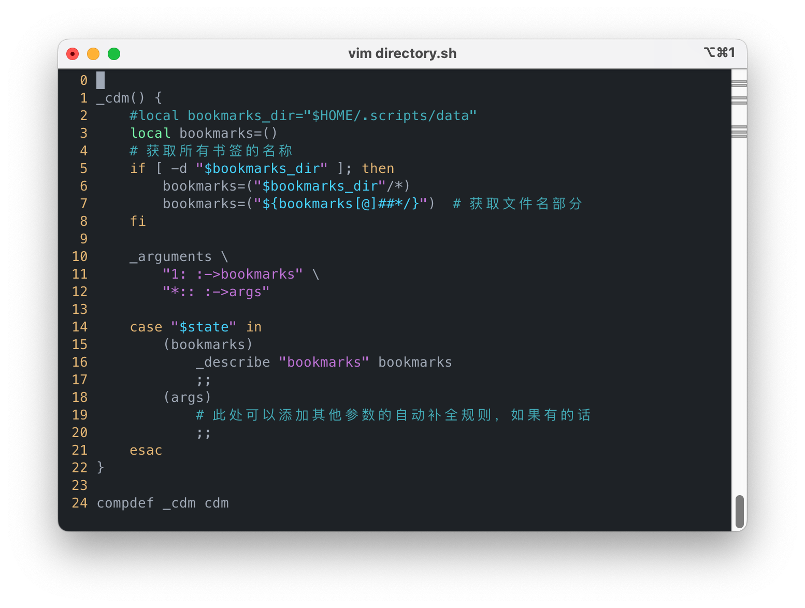
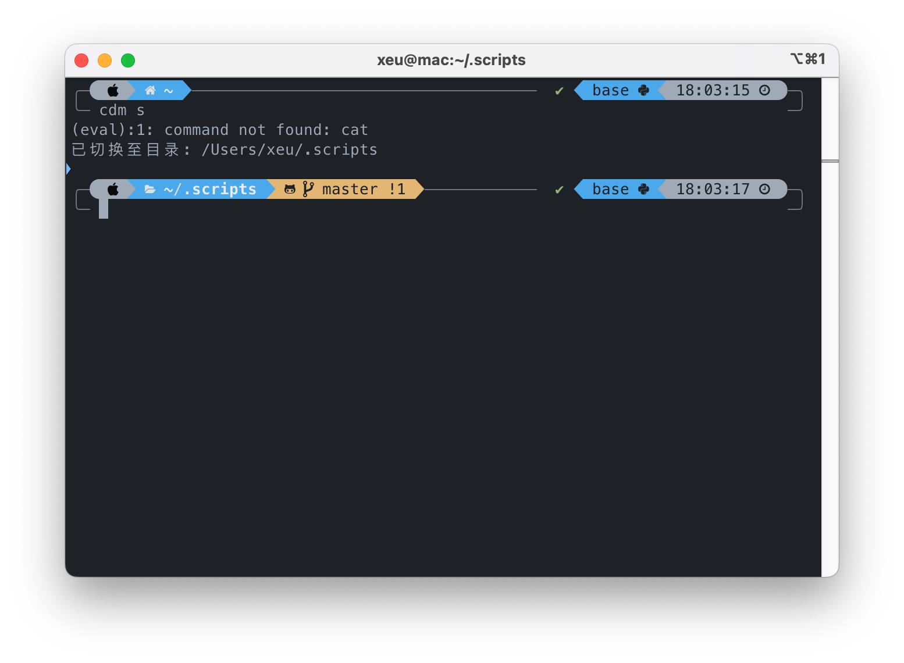
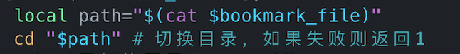
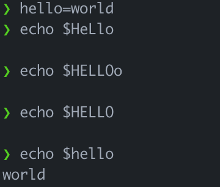
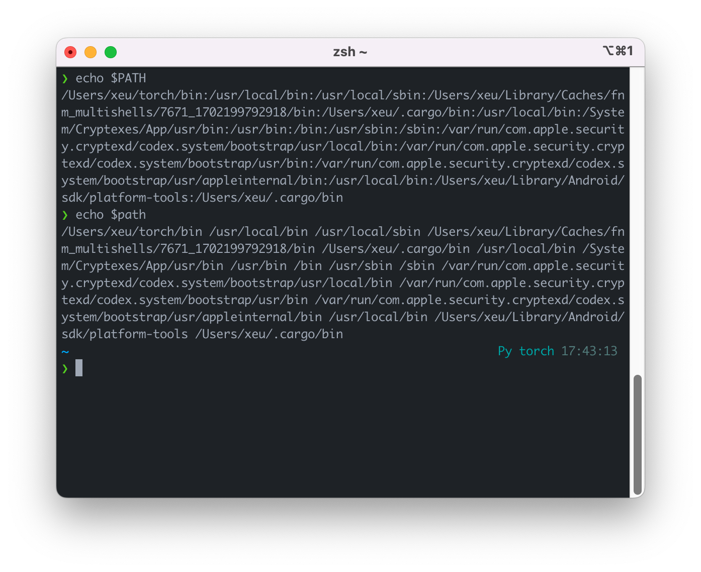
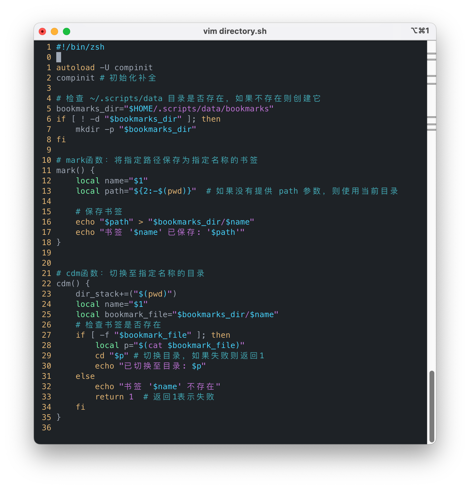

---
aliases:
- /feed/20/
date: 2022-12-10T09:58:28.000Z
description: ''
draft: false
image: 8b08d6b3d7ecf174a54ec001.png
lastmod: 2024-06-10T10:53:18.000Z
slug: shell-variable-naming
tags: []
title: 不要胡乱取名
---
谢师傅觉得一行一行地在命令行里写一些重复的命令实在是太恼人了，但是一想到每次写新脚本需要新建一个脚本文件，写新脚本，保存并添加执行权限，在.profile中添加`source xx.sh`后手动再`source ~/.profile` 一遍谢师傅就觉得麻烦。
# 脚本加载器
但这次谢师傅有些忍受不了了，谢师傅灵机一动，创建一个 `.scripts` 文件夹，然后通过某种手段应用其中的所有脚本，所以谢师傅打算先写一个 `loader.sh`

如此简单的需求谢师傅决定交给 GPT 快速帮他写一个~~（并不是因为谢师傅不会写 Shell Script）~~
```shell
#!/bin/sh

# 获取当前脚本所在的文件夹路径
script_folder="$HOME/.scripts"

# 定义一个数组来存储需要排除的脚本名称
exclude_scripts=("loader.sh")

# 遍历文件夹中的所有脚本文件，排除指定的脚本
for script_file in "$script_folder"/*.sh; do
    # 获取脚本文件的基本名称
    script_name="$(basename "$script_file")"

    # 检查脚本名称是否在排除列表中
    if [[ ! " ${exclude_scripts[@]} " =~ " ${script_name} " ]]; then
        # 检查文件是否存在并且可执行
        if [ -f "$script_file" ] && [ -x "$script_file" ]; then
            echo "执行脚本: $script_file"
            # 执行脚本
            source "$script_file"
        else
            echo "跳过非可执行文件: $script_file"
        fi
    fi
done
```
谢师傅聪明的让 GPT 给他写了一个可以排除哪些文件不加载的列表，防止 `loader.sh` 把自己也给应用一遍导致死循环。

谢师傅将 `source ~/.scripts/loader.sh` 写进了 `.profile` ，考虑到以后会频繁重新加载脚本，谢师傅决定实现的第一个函数就是重新加载函数 `rld`(reload)
```shell
#!/bin/sh
# .scripts/fast-source.sh
rld() {
 # reload all scripts
 source ~/.scripts/loader.sh
}
```
很简单的内容，谢师傅甚至可以用`alias`一行搞定，但谢师傅当时也许是有别的考虑，并未选择这种方式。
不过第一次还是需要手动 `source` 一次，以后就能通过 `rld` 快速的重新加载了

# 目录书签

谢师傅眼看搭好了环境，以后能够愉快地写脚本了，立马写了个**标记书签**与**切换目录**的功能（GPT代劳）


谢师傅快速运行测试了一遍，一切都工作地很好，但是没有自动补全，于是谢师傅再次让GPT代劳写了一个自动补全函数

这下更加完美了。

唯一不完美的是偶然地一天，谢师傅的 Sonoma 寄了，在多次救援无果后，谢师傅不得不滚回 Ventura ，好在之前谢师傅已经将其 push 到 Github，贴心的谢师傅在此之前还写了一个一键安装脚本 `install.sh`
```shell
#!/bin/bash

# 定义仓库地址
# 根据环境变量 SHELLOVE_TYPE 决定仓库地址
# 提示用户输入远程仓库地址，同时提供默认值
read -p "请输入远程仓库地址(https://github.com/ThankRain/shellove.git): " user_input

# 如果用户输入为空，则使用默认仓库地址1
if [ -z "$user_input" ]; then
  repository_url="https://github.com/ThankRain/shellove.git"
# 如果用户输入为"ssh"，则使用仓库地址2
elif [ "$user_input" = "ssh" ]; then
  repository_url="git@github.com:ThankRain/shellove.git"
else
  repository_url="$user_input"
fi

# 输出最终选择的仓库地址
echo "选择的远程仓库地址是：$repository_url"

# 检查是否已经安装过脚本
if [ -d "$HOME/.scripts" ]; then
    echo "已经安装了脚本，跳过安装步骤。"
else
    # 克隆仓库到 $HOME/.scripts 文件夹
    git clone "$repository_url" "$HOME/.scripts"

    # 检查是否成功克隆仓库
    if [ $? -eq 0 ]; then
        echo "脚本成功安装到 $HOME/.scripts 文件夹。"
    else
        echo "安装脚本失败，请检查仓库地址和网络连接。"
        exit 1
    fi
fi

# 检查是否已经在 .profile 中添加了 source 命令
if ! grep -q "~/.scripts/loader.sh" "$HOME/.profile"; then
    # 将 source 命令追加到 .profile
    echo "source ~/.scripts/loader.sh" >> "$HOME/.profile"
    echo ".profile 中添加了 source 命令。"
else
    echo ".profile 中已经存在 source 命令，跳过添加步骤。"
fi
source ~/.scripts/loader.sh
```

 谢师傅虽然对于痛失 Sonoma 感到难受，但是对于自己（GPT）搭建的脚本工作流十分满意，正当谢师傅满意的使用 `cdm` 切换时，他看到了一个奇怪的提示

 他看了一遍自己的 cdm 函数，cat只有第 8 行有使用，

屑师傅百思不得其解，他使用了逐行注释调试法，最终发现注释掉 `cd "$path"` 后不再报错，于是屑师傅果断怀疑是因为 cd 内部实现使用了 cat 才导致的该报错~~（实际上屑师傅是在很久以后才意识到的）~~,那么为什么会导致找不到 cat 呢？屑师傅盯着短短的两行代码看了许久.......


........
突然屑师傅想到 shell 中可执行文件是通过环境变量 PATH 中指定路径去寻找的，如果找不到说明很可能 PATH 变量被修改了......


但是哪里会把 PATH 给改了呢？这里只有个 path，而且还是局部变量，怎么想都不可能...等一下，sHeLl 是不是不区分大小写来着？


不对啊，这明明是区分大小写的，屑师傅迷惑了，但他还是准备试下另外的变量

path 和 PATH 是一样的！于是屑师傅将 path 改成了 p，错误消失！


屑师傅释怀的笑了，至于为什么同样的代码在 Sonoma 上不会出现问题，也许是 zsh 版本不一样修改了实现啥的，但是屑师傅已经不关心了
