---

title: "为静态博客添加评论功能"
date: "2026-09-18T08:26:04.024Z"
description: "评论也能用 SSG 吗？用 Vercel Functions、Resend 和 GitHub Actions 串起邮件审核与静态评论，省去独立数据库，再聊聊我为什么执着于轻量化与长期可用性。"
slug: "ssg-blog-comment"
categories:

- tech
- essays
tags:
- blog
- SSG
- Serverless
- Vercel
- Resend
- GitHub Actions  
draft: false

---

## 一、评论也能用 SSG 吗？

虽然市面上已经有成吨的静态博客站点的评论插件，包括但不限于 Twikoo、Waline、Artalk、Giscus 等产品，但几乎所有插件（除 Giscus 以外，但它会污染 issue，并且依赖 GitHub 登录，个人并不是很喜欢）都需要配置后端和数据库。

虽然为了处理动态的评论需要数据库无可厚非，但总有些人喜欢追求极致轻量化（至于为什么后面再说），换个角度想想：博客的评论增加频率并不高，且对于实时性要求也一般，那评论真的需要动态显示吗？文章既然都可以用 SSG（Static Site Generator，静态站点生成器），**评论能不能也用上 SSG 呢？**

简单考虑下，让评论也用上 SSG 并不难，只需要在生成站点时将评论数据塞入模板中就行了，十分简单。至于如何实现半实时的评论更新稍微想想也不难，只需要在**有新评论时触发站点生成**就行了。

接下来的问题就变成了：如何将用户浏览器中编写的评论发送到我的博客代码仓库中？将 GitHub Token 硬编码到前端？让每个用户都能修改博客仓库的文件？这种方案想必只有刚从 SWE 幼儿园拿到及格分数的笨蛋 LLM 才会干得出来，**Token 肯定是不能直接暴露给前端的**，那就需要一个后端，Vercel Function 就不错。理论上做个 Vercel Function，调用时使用 GitHub Token 在指定目录下创建一个评论的文件就可以（实际实现的时候考虑到复杂度最终变成了派发一个创建评论的 GitHub Actions 工作流）。

但这种方式没有任何审核和反垃圾，要是有人刷一吨垃圾评论进去仓库就炸了，如何加入审核机制呢？如果维护一组待审核回复列表那不可避免还是会引入数据库或者存储服务。**但不引入的话，待审核评论保存在哪呢？**

*Thinking...*


---

> *发动俺寻思之力*...不引入常规的数据库和存储服务...Git 能否充当存储服务？...好像也不行，待审核评论里说不定有某些爆！爆！的东西，要是让所有人都能自由写任何内容进 Git 想必会大爆特爆...感觉需要某些分布式的东西...Git...Linus...Linux...邮件列表...邮件...
>
> **能否将评论直接发到我的邮箱，并提供一个审批按钮，这个按钮点击后会将评论文件写入 Git 仓库呢？**...直接将评论发到邮箱好像可以做，直接用 Vercel Function + Resend 就行...审批按钮点击的链接也接 Vercel Function 去写入 Git 好像就可以！...
>
> 但是这样的话审批按钮点击时就需要带上完整的评论数据，并且我们由于没有数据库和存储服务，其实也不太能做鉴权...如果有人尝试构造一个审批链接的话貌似可以直接绕过...因此可能需要对完整的评论数据做加密，这样就只有自己的 Vercel Function 有加解密的密钥，只要密钥不泄露就没办法构造一个审批链接出来...
>
> 但是如果有人刷 API 的话邮件会被打爆的...在评论的 API 前面加个简单的 Anubis 同款的**工作量证明**验证应该能减缓这个问题...再不济也只是把我的免费 Resend 额度刷光，让其他人没法评论而已...倒是没有明显的经济损失

---

因此，最终凭借俺寻思之力，成功搓出了一个奇妙评论框架：

**评论 → 发送邮件 → 审批触发 GitHub Actions 将评论写入仓库 → Vercel 自动部署**


由于邮件的 `<form>` 标签有概率被邮件提供商过滤掉，因此我们不能用 `POST` 的形式将加密的评论数据放到请求体中，而 URL 长度又有限制，如果评论内容直接放到 URL 中就会受到十分严格的长度限制：

> 不同浏览器的实际支持长度不同：
>
> - **Internet Explorer / 旧版 Edge**：最大限制为 **2083 个字节**。
> - **Google Chrome**：大约支持 **8182 个字符**。
> - **Mozilla Firefox**：支持 **65536 个字符**以上。
> - **Safari**：支持 **80000 个字符**以上。
> - **Opera**：支持 **190000 个字符**以上。

导致评论长度严重受限，怎么办呢？聪明的 Agent 直接**将加密的评论数据放到了 `fragment` 中**（就是 `#` 后面的部分，常用于锚点定位），最终大概的 URL 像这样：

```text
https://xeu.life/comment-review/#token=<加密后的评论payload>
```

而 `fragment` 的大小限制是多少呢？你可以访问这个页面在线测试当前浏览器允许的最大 `fragment` 尺寸：[浏览器 URL fragment 长度测试](https://fastjsonviewer.com/hash-length-limit.html)。

经过实测，Firefox 的 `fragment` 限制是 1MB，Chrome 以及 Chromium 内核的所有浏览器都**没有限制**，唯一的限制是设备的承载能力，非常的夸张。


至此整个框架实现完毕，延伸思考时发现在这套框架下甚至能实现**邮件通知评论人审核通过和被回复的信息**：

> **Agent：** 被回复者的邮箱，来自他当初发表那条评论时填写的“邮箱（选填）”。之后有人回复，服务端会在回复审核通过后，读取原评论保存的邮箱密文，解密并发送通知。
>
> 以「B 回复 A」为例，代码流程是：
>
> 1. **A 发表原评论时收集邮箱。** 前端把 A 填写的邮箱放入 `email` 字段，随评论提交到 Vercel Function。
> 2. **A 的评论审核通过时加密保存。** `sealComment()` 使用 AES-256-GCM 加密邮箱，公开评论 JSON 中保存 `emailEncrypted` 和 `emailHash`，不保存明文邮箱。
> 3. **网站构建时生成查询索引。** Hugo 把已发布评论的邮箱密文整理进 `comment-pages.json`，形成 `notificationEmails[评论 ID]` 映射，供审批接口读取。因此这里不需要查数据库。
> 4. **B 的回复审核通过后，取出 A 的邮箱并发信。** B 的回复通过 `parentId` 指向 A 的评论。审批接口成功启动 GitHub 发布任务后，用这个 ID 查到 A 的邮箱密文，再调用 `openCommentEmail()` 解密，通过 Resend 发送回复通知。
>
> *通知发送时，网站可能还没部署完成。* A 当初没填邮箱就不会收到通知；只通知直接被回复的人；双方邮箱相同时跳过回复通知，仅发送审核通过通知。

最终的整体架构如下：

```mermaid
flowchart LR
    reader["读者提交评论或回复：选填邮箱、parentId"]

    subgraph ingress["接入安全 · 无状态 Vercel Functions"]
        validate["校验 Origin、请求大小、文章白名单及父评论"]
        pow["验证短期 PoW：绑定评论内容、邮箱和 parentId"]
        sign["生成 HMAC 审批凭据：绑定内容、站点及有效期"]
        validate --> pow --> sign
    end

    subgraph moderation["待审数据 · 私有审核邮件承载，无待审数据库"]
        mail["Resend 将评论和审批链接发送给博主"]
        review["博主打开预览后，手动确认批准"]
        mail -->|"凭据放在 URL fragment，页面读取后清除"| review
    end

    subgraph approval["审批安全 · 服务端再次校验"]
        verify["验证审批签名、期限和当前文章及父评论"]
        encrypt["邮箱 AES-256-GCM 加密：绑定评论 ID 和文章路径"]
        dispatch["使用独立用途密钥签名发布数据，提交 GitHub"]
        accepted["GitHub 接受发布任务"]
        verify --> encrypt --> dispatch --> accepted
    end

    subgraph persistence["持久化 · 仅复用 Git 仓库与静态构建产物"]
        action["GitHub Actions 再次验签：检查仓库、目录和父评论"]
        git["每条评论一个 JSON：正文公开，邮箱仅保存密文和带密钥摘要"]
        build["Vercel 自动部署，Hugo 构建"]
        html["静态 HTML：文本转义，不展示邮箱；阅读不调用评论 API"]
        index["comment-pages.json：文章白名单、评论 ID、邮箱密文索引"]

        action -->|"拒绝明文邮箱；重复内容幂等，不覆盖冲突"| git
        git --> build
        build --> html
        build --> index
    end

    subgraph notification["通知隐私 · 仅服务端解密，收件人分别发送"]
        lookup["按 parentId 取得父评论邮箱密文，并验证解密"]
        notify["Resend 发送回复通知：固定幂等键减少重复发送"]
        recipient["直接被回复者收到邮件"]
        lookup -->|"父评论留有邮箱，且与回复者邮箱不同"| notify
        notify --> recipient
    end

    reader --> validate
    sign --> mail
    review -->|"同源 POST；打开链接本身不发布"| verify
    accepted --> action
    accepted -->|"无需等待构建部署完成"| lookup
    index -.->|"随函数打包，读取本地文件"| validate
    index -.->|"审批时校验"| verify
    index -.->|"提供已发布父评论的邮箱密文"| lookup

    classDef secure fill:#e8f5ee,stroke:#238636,color:#173b25
    classDef storage fill:#eaf2ff,stroke:#3975c6,color:#183b65
    classDef private fill:#fff4df,stroke:#b7791f,color:#654510

    class validate,pow,sign,verify,encrypt,dispatch,action secure
    class git,index,html storage
    class mail,review,lookup,notify private
```



你可以在我的博客仓库中查看完整的源代码：[OXeu/shiue](https://github.com/OXeu/shiue)。

---

## 二、为什么还要追求极致轻量化？

话题回到为什么喜欢追求极致轻量化。其实无论是云端的小鸡亦或是本地的 homelab，我并不缺算力、存储去托管一个小小的博客评论系统，但我还是喜欢将其扔在 Serverless 提供商的基础设施上，且尽可能保持小巧，一方面是确实享受这种**在受限条件下创造带来的成就感**，另一方面则是**对自建基础设施可靠性的担忧**。

我的云端的小鸡说不定哪天就不续费或者换新小鸡了，本地的 homelab 说不定某天因为心血来潮直接干掉系统重做，或者是哪天硬盘突然飞升了数据没了，这些都可能导致这个小小的评论系统挂掉。我的个人实践结果表明，**个人自托管的基础设施可靠性远低于云服务厂商**，因此如果有可能让这个为数不多对外提供服务的小系统活得更久一点，我觉得折腾都是有必要的。

*谁也说不准明天和意外哪个先到*，但不难想象我在家里的小鸡大概率会随我飞升，云上的小鸡没人续费也活不了几年，但云服务厂商的免费托管，想必应该是其中能活得最久的那个。


