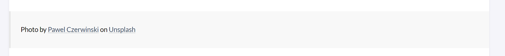

> 封面来源 [Pixiv](https://www.pixiv.net/artworks/87508475)

## 修改引用块

默认的引用块格式是直接顶满整个正文宽度，跟常规的引用块效果不太一样



> 下文中的theme/stack为Stack主题的文件目录，我将Stack主题默认文件路径（似乎是theme/hugo-theme-stack）修改到theme/stack了

将`theme/stack/assets/scss/partical/article.scss`中的以下内容：

```CSS
/// Negative margins
blockquote,
figure,
.highlight,
pre,
.gallery,
.video-wrapper,
.table-wrapper,
.s_video_simple {
    margin-left: calc((var(--card-padding)) * -1);
    margin-right: calc((var(--card-padding)) * -1);
    width: calc(100% + var(--card-padding) * 2);
    }
    ```

修改为：

```css
/// Negative margins
blockquote,
figure,
.highlight,
pre,
.gallery,
.video-wrapper,
.table-wrapper,
.s_video_simple {
    width: 100%;
    }
    ```

即可。不过同时也会将`figure`,`highlight`,`pre`,`gallery`,`video-wrapper`,`table-wrapper`,`s_video_simple`的负边距给去掉,可以自己酌情修改。

## 修改 Tag 样式

Stack 默认的 Tag 样式个人觉得 padding 过大并且不是大圆角观感一般，因此将其修改了一下：

```CSS
// theme/stack/assets/scss/partical/article.scss
.article-category,
.article-tags {
    display: flex;
    gap: 10px;

a {
    color: var(--accent-color-text);
    background-color: var(--accent-color);
    padding: 4px 8px; ///修改padding
    border-radius: 100px; ///圆角拉满
    display: inline-block;
    font-size: 1.4rem;
    transition: background-color 0.5s ease;

&:hover {
    color: var(--accent-color-text);
    background-color: var(--accent-color-darker);
    }
    }
    }
    ```

## 修改代码块样式

Hugo自带的代码高亮总感觉有问题，特别是`Kotlin`高亮亮了等于没亮，于是打算将高亮引擎从默认的`Chroma`切换到`Highlight.js`。

但是`Chroma`渲染的HTML结构`Highlight.js`似乎不能直接渲染(我也不是很清楚到底渲染成功没，因为好像确实都差不多)

### 添加代码块模板

参考官方文档[Markdown Render Hooks | Hugo (gohugo.io)](https://gohugo.io/templates/render-hooks/)在`themes/stack/layouts/_default/_markup`文件夹下创建`render-codeblock.html`，填入以下代码：

```html
<pre class="custom">
    <code class="language-{{.Type}}">
        {{- .Inner | safeHTML }}
        </code></pre>
        ```

同时引入`Highlight.js`，可以直接使用CDN引入

```html
<!--themes/stack/layouts/partials/head/style.html-->
{{ if eq .Site.Params.syntaxHighlighter "highlight.js" }}
<link rel="stylesheet"
href="//cdn.jsdelivr.net/gh/highlightjs/cdn-release@11.6.0/build/styles/default.min.css">
<script src="//cdn.jsdelivr.net/gh/highlightjs/cdn-release@11.6.0/build/highlight.min.js"></script>
<script>hljs.highlightAll();</script>
{{ end }}
```

也可以在 [Getting highlight.js](https://highlightjs.org/download/) 自定义语言然后下载下来全部解压放到根目录的`static`文件夹下，这里我选择下载到本地然后手动引入：

目录结构：

```
static
   ├── code-header.svg
   ├── es
   ├── highlight.min.js
   ├── languages
   └── styles
```

引入：

```html
<!--themes/stack/layouts/partials/head/style.html-->{{ if eq .Site.Params.syntaxHighlighter "highlight.js" }}
<link rel="stylesheet"
href="/styles/default.min.css">
<script src="/highlight.min.js"></script>
<script>hljs.highlightAll();</script>
{{ end }
```

同时我特别喜欢[Markdown | 让排版变 Nice (mdnice.com)](https://editor.mdnice.com/)的代码块风格，于是又从那把css抄了过来

```scss
/// theme/stack/assets/scss/partials/layout/article.scss
/// 将 .article-content 中的 pre 块处修改为以下代码
pre {
    overflow-x: auto;
    display: block;
    background-color: var(--pre-background-color);
    color: var(--pre-text-color);
    font-family: var(--code-font-family);
    line-height: 1.428571429;
    word-break: break-all;
    //  keep Codeblocks LTR
    [dir="rtl"] & {
        direction: ltr;
        }
        code {
            border: none;
            padding: 0;
            padding-top: 15px;
            background: #282c34;
            border-radius: 5px;
            }
            }

.custom {
    border-radius: 5px;
    }

.hljs-deletion, .hljs-number, .hljs-quote, .hljs-selector-class, .hljs-selector-id, .hljs-string, .hljs-template-tag, .hljs-type {
    color: #5daf34;
    }

.custom:before {
    content: '';
    display: block;
    background: url(/code-header.svg);
    height: 30px;
    width: 100%;
    background-size: 40px;
    background-repeat: no-repeat;
    background-color: #282c34;
    margin-bottom: -7px;
    border-radius: 5px;
    background-position: 10px 10px;
    }
    ```

其中`/code-header.svg`为代码块顶部的macOS风格的红绿灯小图标，在根目录创建`static`文件夹，创建`code-header.svg`文件：
```xml
<svg xmlns="http://www.w3.org/2000/svg" version="1.1"  x="0px" y="0px" width="450px" height="130px">
    <ellipse cx="65" cy="65" rx="50" ry="52" stroke="rgb(220,60,54)" stroke-width="2" fill="rgb(237,108,96)"/>
    <ellipse cx="225" cy="65" rx="50" ry="52"  stroke="rgb(218,151,33)" stroke-width="2" fill="rgb(247,193,81)"/>
    <ellipse cx="385" cy="65" rx="50" ry="52"  stroke="rgb(27,161,37)" stroke-width="2" fill="rgb(100,200,86)"/>
    </svg>
    ```

## 修改滚动条样式

默认的Stack滚动条基本上使用的是浏览器默认的滚动条，特别粗。

在`themes/stack/assets/scss/partials/article.scss`最外层加上以下内容

```scss
::-webkit-scrollbar {
    width: 6px;
    height: 6px;
    }
    ::-webkit-scrollbar-thumb {
        border-radius: 3px;
        background: rgba(0,0,0,.12);
        /* box-shadow: inset 0 0 10px rgb(0 0 0 / 20%); */
        }
        ::-webkit-scrollbar-track {
            border-radius: 3px;
            background: rgba(0,0,0,.06);
            box-shadow: inset 0 0 5px rgba(0,0,0,8%);
            }

```

> 其实Stack的滚动条样式在`themes/stack/assets/scss/partials/base.scss`里，但是我懒得改了

## 参考资料

1. [Markdown Render Hooks | Hugo (gohugo.io)](https://gohugo.io/templates/render-hooks/)
2. [Markdown | 让排版变 Nice (mdnice.com)](https://editor.mdnice.com/)
3. [Hugo 不完美教程 - II: Hugo 目录组织 - 简书 (jianshu.com)](https://www.jianshu.com/p/c5297a8bb1e7)
4. [Blog养成记(3) Hugo的语法高亮配置 | ZHENG Zi'ou (orianna-zzo.github.io)](https://orianna-zzo.github.io/sci-tech/2018-01/blog养成记3-hugo的语法高亮配置/#/pygments存在问题)
5. [Hugo 代码高亮 (maintao.com)](https://maintao.com/2021/code-syntax-highlight/)